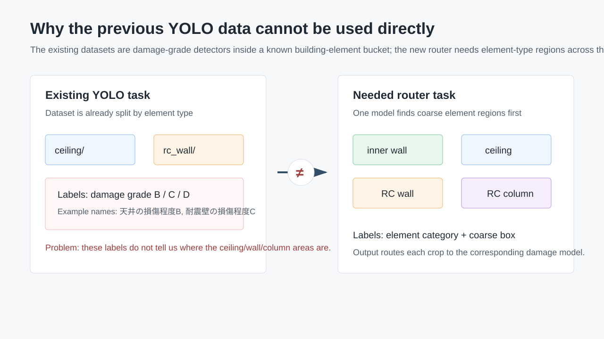
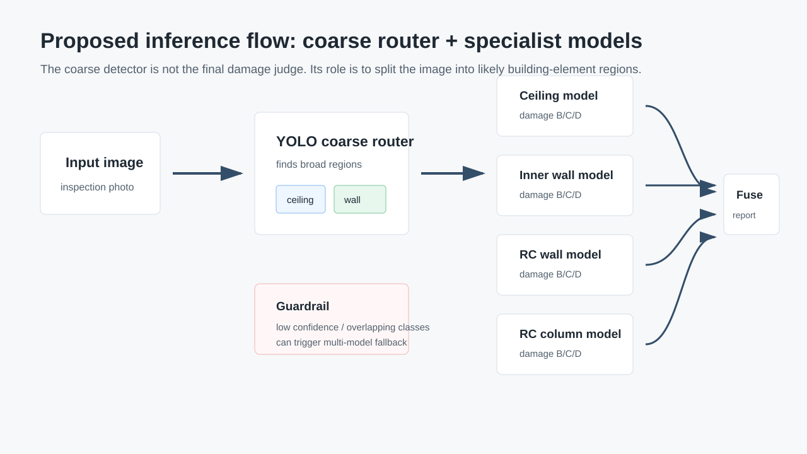
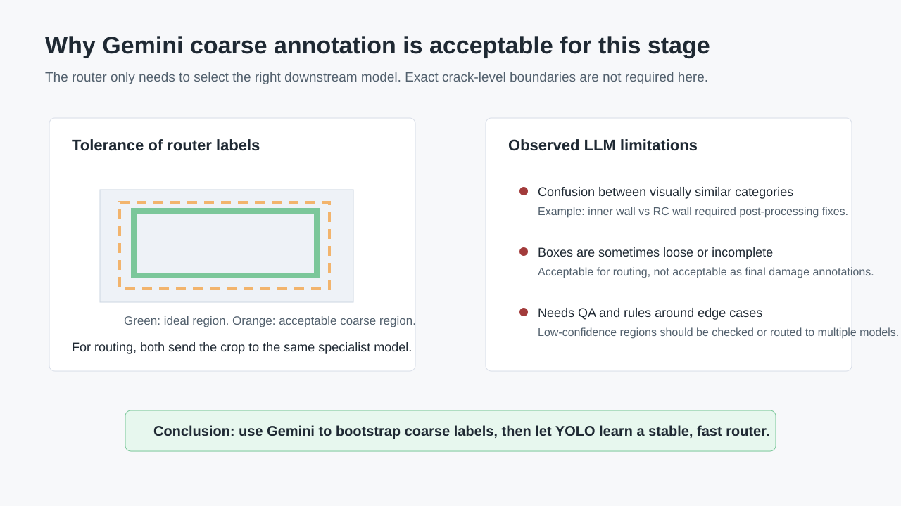
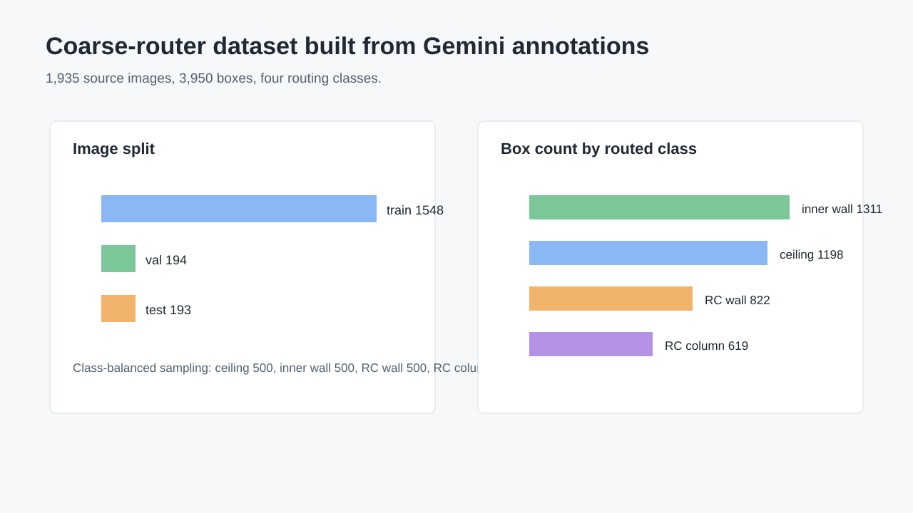
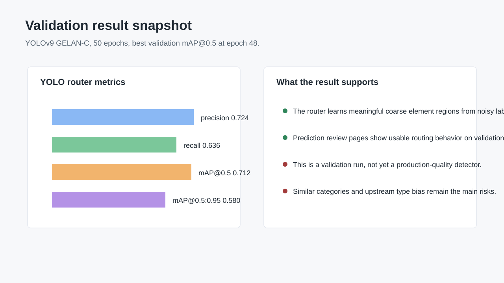

# YOLO 粗筛路由方案汇报草稿

面向客户的核心叙事：我们不是把 YOLO 当作最终损伤等级判断模型，而是把它放在前面做“粗筛路由”。YOLO 先把图像中可能属于天井、内壁、RC 壁、RC 柱的区域粗略切出来，再把不同区域交给对应的专用损伤模型。这样可以复用后续专用模型，同时降低一个通用模型同时处理所有构件和所有损伤等级的难度。

## 1. 为什么之前的 YOLO 数据不能直接用

现有 `data/shimizu-split/*/data.yaml` 里的 YOLO 数据本质上是“已知构件类型下的损伤等级检测”：

| 数据目录 | 现有标签 |
| --- | --- |
| `ceiling` / `ceiling-aug` | `天井の損傷程度B/C/D` |
| `inner_wall` | `内壁の損傷程度B/C/D` |
| `rc_wall` | `耐震壁の損傷程度B/C/D` |
| `rc_column` | `RC柱の損傷程度B/C/D` |

这和我们现在需要的粗筛任务不同。粗筛任务需要在同一张图上先判断“这里是天井、内壁、RC 壁还是 RC 柱”，输出的是构件类型区域，而不是损伤 B/C/D。旧数据已经按构件类型拆成了不同子数据集，标签只表达损伤等级，因此不能直接训练一个统一的构件路由器。

可视化图：

可补充展示的旧数据样例：

- `data/shimizu-split/ceiling-aug/visualize/1-B-00001_cutmix_128_vis.jpg`
- `data/shimizu-split/ceiling-aug/visualize/1-B-00002_cutmix_131_vis.jpg`

这些图适合用来说明：旧 YOLO 框选的是损伤位置和损伤等级，不是“建筑构件区域”。

## 2. 设计的模型推理思路

推理链路如下：

1. 输入巡检图像。
2. YOLO 粗筛模型检测四类构件区域：`天井`、`内壁`、`RC壁`、`RC柱`。
3. 将检测到的区域裁剪或带上下文送入对应专用模型。
4. 专用模型输出该构件的损伤等级或进一步的损伤信息。
5. 汇总所有区域结果，生成整图级报告。

这个设计的重点是“先分流、后精判”。粗筛模型只承担路由职责，因此它对边界的精度要求低于最终损伤检测模型；只要能把区域送到正确的专用模型，就能产生价值。

## 3. 为什么使用 Gemini 做粗标注

我们缺少直接可用的“构件类型 + 粗框”标注。人工重标注成本较高，而这个阶段的目标不是建立最终精细标注集，而是验证“粗筛路由”是否可行。因此使用 Gemini 生成初始粗框是合理的：

- 粗筛只需要决定调用哪个专用模型，类别划分比像素级/裂缝级边界更重要。
- 框的位置可以相对宽松，只要覆盖主要构件区域并保留上下文即可。
- LLM/VLM 能快速给出跨类别的初始构件区域，适合做可行性验证和训练冷启动。
- 后续可以用少量人工 QA、规则修正和主动学习逐步提高标注质量。

Gemini 标注产物：

- 初始平衡批次：`outputs/gemini_balanced_300x4_3_1_pro/summary.json`
- 规模：`1200` 张，四类各 `300` 张，`ok=1200`，无 API 错误。
- 合并补充和修正后：`outputs/gemini_wall_label_fixed_3_1_pro/summary.json`
- 去重后图像：`1935` 张。
- 预期来源类别：天井 `500`、内壁 `500`、RC壁 `500`、RC柱 `435`。

Gemini 标注的不足也需要明确说明：

- 内壁与 RC 壁这类相似类别存在混淆，后处理里已经发现并修正了 `内壁:RC壁->内壁`、`RC壁:内壁->RC壁` 这类问题。
- 框可能偏松、漏掉局部区域或把背景包含进去，适合作为粗筛训练信号，但不能直接作为最终损伤标注。
- 当图像里存在多个构件、遮挡、视角偏差或构件类型不典型时，LLM 可能输出不稳定。

可展示的 Gemini 视觉样例：

- `outputs/gemini_coarse_3_1_pro_50x4/contact_sheet.jpg`
- `outputs/gemini_coarse_3_1_pro_50x4/index.html`
- `outputs/gemini_coarse_3_1_pro_50x4/visualizations/001_a-10001.jpg`

## 4. 训练数据和结果可视化

基于 Gemini 修正后的结果，我们构建了 YOLO 格式粗筛数据集：

- 数据集：`coarse_router_yolov9/datasets/coarse_cross_fixed`
- 类别：`天井`、`内壁`、`RC壁`、`RC柱`
- 源图像：`1935`
- 总框数：`3950`
- 划分：train `1548`、val `194`、test `193`
- 构件框数：天井 `1198`、内壁 `1311`、RC壁 `822`、RC柱 `619`

训练与验证：

- 模型：YOLOv9 GELAN-C
- 训练轮数：50 epochs
- 训练结果文件：`coarse_router_yolov9/runs/train/gelan_c_cross_fixed_e50/results.csv`
- 最优验证 epoch：48
- precision：`0.724`
- recall：`0.636`
- mAP@0.5：`0.712`
- mAP@0.5:0.95：`0.580`

可展示的模型结果页面和图：

- 标注检查页：`coarse_router_yolov9/qa/coarse_cross_fixed_labels/index.html`
- 预测对比页：`coarse_router_yolov9/qa/model_review_conf025/index.html`
- 测试集预测页：`coarse_router_yolov9/qa/model_review_conf025/test.html`
- 验证集预测页：`coarse_router_yolov9/qa/model_review_conf025/val.html`
- 混淆矩阵：`coarse_router_yolov9/runs/val/gelan_c_cross_fixed_e50_best_test/confusion_matrix.png`
- PR 曲线：`coarse_router_yolov9/runs/val/gelan_c_cross_fixed_e50_best_test/PR_curve.png`
- F1 曲线：`coarse_router_yolov9/runs/val/gelan_c_cross_fixed_e50_best_test/F1_curve.png`
- GT/Pred 样例：`coarse_router_yolov9/runs/val/gelan_c_cross_fixed_e50_best_test/val_batch0_labels.jpg` 和 `val_batch0_pred.jpg`

结论表达建议：

> 从数值上看，验证 mAP@0.5 已达到 0.712；从预测 review 页面看，模型已经能够在一部分图像上把主要构件区域切出来。因此本轮验证支持“YOLO 粗筛 + 专用模型分流”的技术路线，但还不是生产级结果。

## 5. 展望和不足

当前主要风险有两类。

第一类是相似构件类别的标注问题，例如内壁与 RC 壁。解决方向：

- 建立少量人工审核集，重点覆盖相似类别、边界样例和模型低置信样例。
- 将内壁/RC 壁混淆样本作为 hard cases，迭代补充训练集。
- 在标注规则里明确判别依据，例如材质、纹理、结构位置、上下文区域。
- 引入二阶段校正：粗筛后对相似类别再做一个轻量分类器或 VLM 复核。

第二类是前面建筑类型判断错误导致后续调用错误模型的累积误差。规避方向：

- 对低置信度框设置多模型 fallback，例如同时调用 Top-2 构件模型，再用结果一致性或置信度融合。
- 对重叠或冲突区域保留多个候选，不要过早做硬分类。
- 在最终报告里保留路由置信度，当路由不确定时标记为需复核。
- 使用端到端回流机制：如果下游专用模型输出异常低置信度，则回退到其他构件模型或触发人工审核。
- 持续收集错误路由样本，形成主动学习闭环。

建议明天汇报的主线：

1. 旧 YOLO 数据不能直接用，因为任务标签不一致。
2. 我们把问题改造成“先构件粗筛，再专用模型判断”的路由架构。
3. Gemini 粗标注足以支持路由验证，因为这里不要求最终损伤级精确边界。
4. 训练结果已经证明该路线具备可行性。
5. 后续重点是相似类别 QA、低置信 fallback 和防止路由误差向下游累积。
