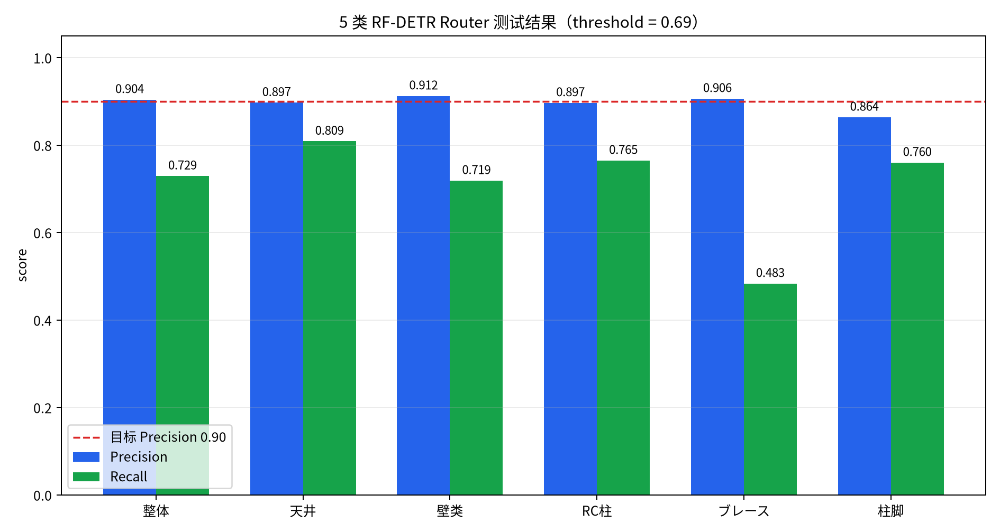
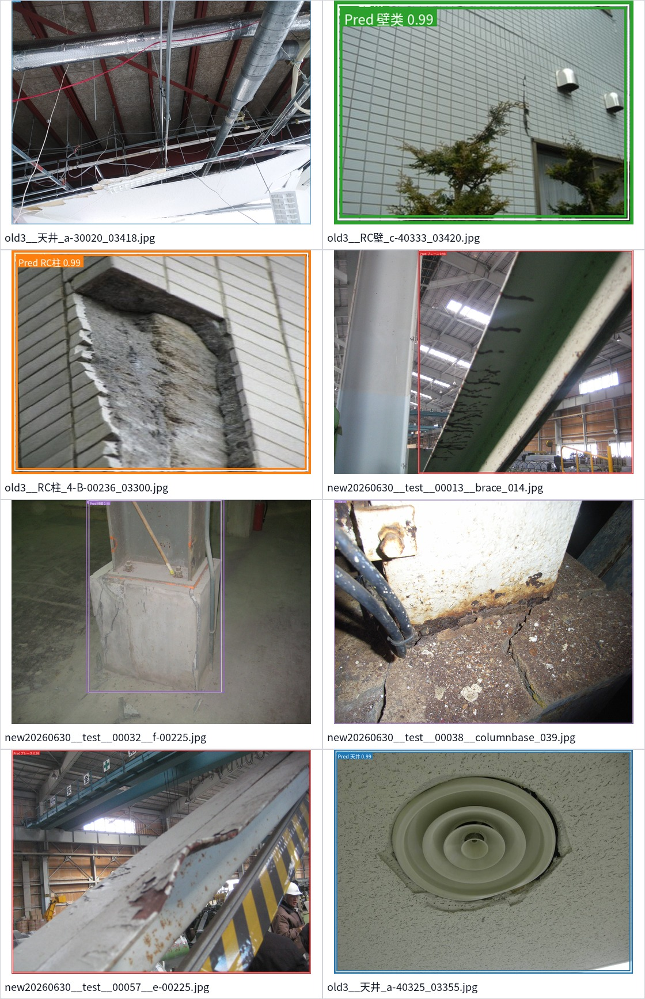
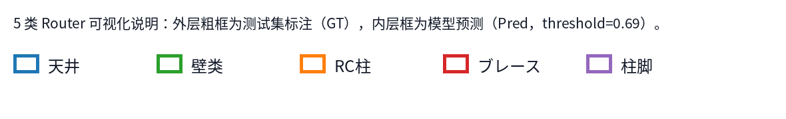

# 2026-07-01 会议资料：5 类 Router 训练结果与 Pipeline rule-base 说明

## 会议目标

本次会议建议聚焦两个问题：

1. 说明新增 `ブレース / 柱脚` 后，5 类 RF-DETR router 已完成训练，并且整体 Precision 达到 `0.9039`，超过客户要求的 `0.90`。
2. 用客户能理解的方式解释 pipeline 中各类 rule-base 合并机制，包括为什么需要合并、哪些地方是 NMS、哪些地方是壁类业务合并、哪些参数控制 IoU / IoA。

建议主结论：

> 5 类 router 已经可以作为下一阶段集成候选模型。整体 Precision 超过 0.90；新增类别已经进入统一 5 类训练框架。Pipeline 后处理不是简单地“模型出什么就显示什么”，而是分成候选保留、区域筛选、重复框整理、壁类业务合并、最终显示整理几层，每层规则都有明确目的和参数。

## 可视化素材

5 类 router 指标图：



5 类 router 测试集预测样例：



图例说明：



说明口径：

- 外层粗框是测试集标注。
- 内层框是模型预测，使用部署候选阈值 `threshold = 0.69`。
- 这些图用于说明 5 类 router 的可视化效果；最终业务 pipeline 的损伤检测合并逻辑仍按后续 rule-base 流程处理。

## 建议 PPT 结构

| 页 | 标题 | 核心信息 |
|---:|---|---|
| 1 | 本次更新概要 | 新增 2 类，router 从 3 类扩展到 5 类；整体 Precision 超过 0.90 |
| 2 | 5 类 Router 训练设置 | 类别、数据来源、test-only 评估口径、阈值 0.69 |
| 3 | 5 类 Router 数值结果 | 整体 Precision 0.9039，Recall 0.7293，F1 0.8073 |
| 4 | 5 类 Router 可视化 | 展示新增类和旧类的预测样例 |
| 5 | Pipeline 为什么需要 rule-base | 模型输出是候选，需要整理成用户可看的最终结果 |
| 6 | IoU / IoA 通俗解释 | IoU 看两个框互相重叠多少；IoA 看一个小框是否基本被另一个框覆盖 |
| 7 | Router 区域筛选规则 | full-image-filter，中心点在区域内或 IoA >= 0.50 即保留 |
| 8 | 损伤候选 NMS | 当前 `crack_merge` 是删除重复框，不做坐标融合 |
| 9 | 壁类业务合并 | 内壁模型和 RC 壁模型统一显示为 `壁-B/C/D` |
| 10 | 最终显示合并与歧义保留 | 重叠显示框做整理；跨类别歧义保留候选给前端确认 |
| 11 | 当前结论与下一步 | 5 类 router 可进入集成；后续确认新增类 downstream 处理方式 |

## 1. 5 类 Router 结果

### 1.1 类别定义

本次 router 从原来的 3 类扩展为 5 类：

| id | 类别 | 说明 |
|---:|---|---|
| 0 | 天井 | 既有类别 |
| 1 | 壁类 | `内壁 + RC壁` 在 router 层合并 |
| 2 | RC柱 | 既有类别 |
| 3 | ブレース | 本次新增 |
| 4 | 柱脚 | 本次新增 |

### 1.2 数据与训练口径

训练采用 5 类整体重新训练，而不是在旧 3 类模型后面追加一个独立模型。

原因：

- router 是 pipeline 的入口，类别之间会互相竞争；统一 5 类训练能让模型在同一张图里比较 `天井 / 壁类 / RC柱 / ブレース / 柱脚`。
- 如果做成两个模型，后续还要再处理两个 router 输出之间的冲突，pipeline 复杂度会增加。
- 统一训练后，部署时只需要一个 router checkpoint 和一个类别表。

本次数据集：

```text
data/rfdetr_router_5class_brace_columnbase_20260630_test_as_valid
```

重要说明：

- 本次按要求不使用独立 validation split。
- RF-DETR 训练接口需要 `valid` 目录，因此 `valid` 是 `test` 的镜像。
- 会议上建议表述为：“本次只有 test 评估集，训练日志里的 valid 指标实际等同 test 指标。”

### 1.3 训练结果

部署候选 checkpoint：

```text
outputs/rfdetr_router/medium_5class_brace_columnbase_20260630_test_as_valid/selected_precision_p090_epoch049_thr069.pth
```

部署候选阈值：

```text
confidence_threshold = 0.69
```

整体结果：

| 指标 | 数值 |
|---|---:|
| Precision | **0.9039** |
| Recall | 0.7293 |
| F1 | 0.8073 |

建议讲法：

> 客户要求 router 的 Precision 达到 0.90。我们这次在 5 类条件下，整体 Precision 达到 0.9039，已经超过 0.90。这里的 Precision 可以理解为：系统判断“这里有某类构件”的结果里，有多少比例是正确的。

### 1.4 分类别结果

| 类别 | Precision | Recall | F1 |
|---|---:|---:|---:|
| 天井 | 0.8970 | 0.8087 | 0.8506 |
| 壁类 | 0.9123 | 0.7187 | 0.8040 |
| RC柱 | 0.8966 | 0.7647 | 0.8254 |
| ブレース | 0.9062 | 0.4833 | 0.6304 |
| 柱脚 | 0.8636 | 0.7600 | 0.8085 |

建议说明：

- 当前达成的是整体 Precision >= 0.90，不是每个单独类别都 >= 0.90。
- `ブレース` 的 Precision 达到 0.9062，但 Recall 偏低，说明模型比较谨慎：判出来的较准，但漏掉一些。
- `柱脚` 的 Recall 还可以，但 Precision 低于 0.90，后续可以通过更多人工标注或类别阈值单独调优继续改善。
- 当前作为 router 入口模型，整体目标已经达成；是否要求每个类别单独达到 0.90，需要后续单独定义验收标准。

## 2. Pipeline 中 rule-base 的通俗解释

### 2.1 为什么不能直接显示模型原始输出

模型输出的是很多候选框，不是最终业务结果。直接显示会有几个问题：

- 同一个损伤可能被多个模型或多个等级重复框出来。
- 内壁模型和 RC 壁模型都会输出壁相关结果，但前端希望统一显示成 `壁-B/C/D`。
- 部材交界处可能同时像墙、柱、天井，模型会给出多个解释。
- 有些检测框刚好跨出 router 区域，如果只按严格裁剪会误删。
- 如果某个区域下游模型没有输出，需要有兜底策略，避免最终结果空白。

因此 pipeline 的 rule-base 不是“替代模型判断”，而是把模型候选整理成更适合客户查看的最终结果。

## 3. IoU / IoA 的客户向解释

### 3.1 IoU 是什么

IoU 可以解释为：

> 两个框重叠部分，占两个框合起来总面积的比例。

直观理解：

| IoU | 含义 |
|---:|---|
| 0.0 | 两个框完全不重叠 |
| 0.5 | 两个框有明显重叠，但不完全一致 |
| 0.9 | 两个框几乎是同一个位置 |

在 pipeline 里，IoU 常用于判断：

- 两个检测框是不是在说同一个对象。
- 是否应该删除重复框。
- 是否应该把两个候选归为同一组。

### 3.2 IoA 是什么

IoA 可以解释为：

> 一个框有多少比例被另一个框覆盖。

它和 IoU 的区别是：IoU 对大小差异比较敏感；IoA 更适合处理“一大一小”的情况。

例子：

- 一个小裂缝框在一个大墙面区域里面。
- 因为墙面框很大，IoU 可能不高。
- 但小裂缝框几乎完全落在墙面区域内，IoA 会很高。

所以 pipeline 同时使用 IoU 和 IoA，避免因为框大小不同而误删合理候选。

## 4. 当前 Pipeline 的主要规则和参数

以下参数来自当前配置：

```text
systems/rfdetr/pipeline/rfdetr_prod_pipeline/configs/pipeline.rfdetr_prod.all_small_boxes.yaml
```

### 4.1 Router 候选保留

| 参数 | 当前值 | 客户向解释 |
|---|---:|---|
| `router_conf_threshold` | 0.00 | router 原始候选尽量不在最前面删掉 |
| `router_low_conf_threshold` | 0.03 | 低置信候选保底线 |
| `router_max_det` | 12 | 最多保留 12 个 router 检测框 |
| `router_max_regions` | 4 | 最多送 4 个区域进入后续处理 |
| `router_overlap_policy` | keep_all | router 阶段不因为重叠就提前删除 |
| `dominant_router_class_policy.enabled` | false | 不再因为某一类很强就提前删除其他类别 |

建议讲法：

> Router 是入口，如果这里太早删掉候选，后面 downstream 模型就没有机会修正。所以现在 router 阶段偏向“先保留合理候选”，后面再用检测结果和显示规则整理。

### 4.2 Router 区域筛选 downstream 结果

当前方式：

```yaml
region_transport: full_image_filter
region_filter_mode: center_or_ioa
region_filter_ioa_threshold: 0.50
```

含义：

- 下游损伤模型对整张图推理。
- 然后用 router region 去筛选结果。
- 满足以下任一条件就保留：
  - 检测框中心点在 router region 内。
  - 检测框自身至少 50% 面积落在 router region 内。

客户向解释：

> 以前如果只看框是否完全在区域里，边界上的损伤容易被误删。现在改成“中心点在区域内，或者至少一半面积在区域内”就保留，更适合实际建筑照片里的边界情况。

### 4.3 Downstream 空输出兜底

当前配置：

```yaml
downstream_empty_fallback:
  enabled: true
  dynamic: true
  min_threshold: 0.03
  step: 0.05
  max_outputs_per_region: 1
```

含义：

- 如果某个 router 区域内，下游模型没有输出，就逐步降低阈值再看一次。
- 每次降低 `0.05`。
- 最低降到 `0.03`。
- 每个区域最多补 1 个候选。

客户向解释：

> 这是为了避免“明明图里可能有损伤，但最终画面完全空白”。它不是无限制增加候选，而是在空输出时最多补一个最可能的候选。

### 4.4 Crack merge：当前是 NMS，不是坐标融合

当前配置：

```yaml
crack_merge:
  mode: nms
  same_grade_iou_threshold: 0.90
  cross_grade_iou_threshold: 0.95
  prefer_higher_grade: true
```

含义：

- 同等级候选：如果 IoU > 0.90，认为几乎是同一个框，删除低优先级候选。
- 不同等级候选：如果 IoU > 0.95，才认为几乎完全重合，删除低优先级候选。
- 优先保留更高 damage grade；同等级时保留 confidence 更高的。

重点说明：

> 当前 `crack_merge` 是 NMS，也就是“重复框删除”。它不会把两个框的坐标平均，也不会生成一个加权融合的新框。

为什么跨等级阈值更严格：

- B/C/D 是不同损伤等级。
- 如果两个等级框只是部分重叠，不应该轻易删掉其中一个。
- 只有几乎完全重合时，才按高等级优先保留。

### 4.5 `prod_like` 坐标融合目前没有启用

代码里保留了另一套逻辑：

```text
prod_like_merge_detections
```

它会做：

- 同一模型内按 IoA 删除低等级/重复候选。
- 跨模型按 IoU 分组。
- 对同组框做 confidence 加权坐标融合。

但当前配置是：

```yaml
crack_merge.mode: nms
```

所以会议上建议明确说：

> 当前正式口径没有启用坐标融合。现在的主逻辑是重复框删除和显示层整理。是否切换到坐标融合，需要客户确认，因为它会改变最终框的位置和评估口径。

### 4.6 壁类业务合并

当前壁类显示规则：

```yaml
wall_display:
  mode: rule_merged
  pair_iou_threshold: 0.60
  pair_ioa_threshold: 0.98
  min_single_confidence_by_model:
    inner_wall: 0.20
    rc_wall: 0.10
  use_union_bbox_for_pairs: true
```

含义：

- 内壁模型和 RC 壁模型都可以产生壁类候选。
- 如果两个候选空间上足够重叠，则组合成一个壁类显示结果。
- 配对条件：
  - IoU >= 0.60，或
  - IoA >= 0.98。
- 配对后，显示框使用两个框的外接矩形，也就是 union bbox。

客户向解释：

> 业务上客户最终不想看到“内壁模型结果”和“RC壁模型结果”两个技术类别，而是希望看到统一的 `壁-B/C/D`。所以这一步是业务显示规则，不是模型训练类别。

壁等级组合规则：

| 内壁模型 | RC壁模型 | 前端显示 |
|---|---|---|
| B | B | 壁-B |
| B | C | 壁-C |
| B | D | 壁-D |
| C | B | 壁-B |
| C | C | 壁-C |
| C | D | 壁-D |
| D | B | 壁-D |
| D | C | 壁-D |
| D | D | 壁-D |

注意：

- `C + B -> 壁-B` 是当前业务规则中的特殊处理。
- `D` 相关组合更倾向保留 D 风险。
- 未配对的单模型壁候选也可以显示为壁类，但需要达到单模型置信度阈值。

### 4.7 壁类候选的二次显示整理

当前配置：

```yaml
wall_display:
  merge_overlapping_display_items: true
  display_cluster_iou_threshold: 0.35
  display_cluster_ioa_threshold: 0.70
```

含义：

- 多个壁类显示结果如果位置接近，会再整理成更少的展示框。
- IoU >= 0.35 或 IoA >= 0.70 时，可以归为同一展示组。

客户向解释：

> 这一步主要是为了减少画面上密密麻麻的重复壁类框，让用户看到一个更清楚的代表范围。

### 4.8 最终显示层整理

当前配置：

```yaml
final_display_postprocess:
  enabled: true
  collapse_ambiguity:
    enabled: false
  cluster_same_family:
    enabled: true
    iou_threshold: 0.35
    ioa_threshold: 0.70
  dominant_router_filter:
    enabled: true
    min_confidence: 0.90
    min_confidence_margin: 0.25
```

含义：

- 同一类显示候选如果重叠明显，会合并为更少的显示项。
- 跨类别 ambiguity 不自动压成一个类别，保留候选信息。
- 如果 router 对某个部材非常确定，且与其他候选差距足够大，可以过滤掉明显弱的其他类别候选。

客户向解释：

> 最终显示层不是改模型结果，而是为了让画面更可读。对于同一位置的多个解释，我们保留候选信息；对于明显重复的框，我们减少重复显示。

### 4.9 Cross-class ambiguity：不同部材重叠时不强行改判

当前策略：

- 如果同一位置同时出现 `壁类` 和 `RC柱` 等不同部材解释，不直接强行选一个。
- 显示层可以用一个代表框减少视觉混乱。
- 但候选数据保留给前端和人工确认。

客户向解释：

> 建筑照片里墙、柱、天井边界经常同时出现。系统不应该在证据不足时强行把另一类候选删掉，所以我们保留候选解释，让最终确认更透明。

## 5. 建议会议讲解词

### 5.1 5 类 router 讲解词

> 这次我们把 router 从原来的 3 类扩展到了 5 类，新增了 `ブレース` 和 `柱脚`。训练方式不是外挂一个新模型，而是把 5 个类别放到一个 RF-DETR router 里统一训练。这样部署时只有一个 router，类别之间的竞争也在同一个模型里完成。

> 本次选择的运行点是 threshold 0.69。在测试集上整体 Precision 是 0.9039，超过客户要求的 0.90。也就是说，系统判断出来的构件候选里，整体上超过 90% 是正确的。

> 需要补充的是，这里达成的是整体 Precision 目标。新增类别中 `ブレース` 的 Precision 已经超过 0.90，但 Recall 还有提升空间；`柱脚` 的 Precision 还未到 0.90。下一步如果客户要求每个类别都单独超过 0.90，可以做类别独立阈值调优或继续补人工标注。

### 5.2 Rule-base 总体讲解词

> Pipeline 里有多层 rule-base，原因是模型输出不是最终业务结果。模型会给出很多候选框，有些是重复框，有些是不同模型对同一位置的不同解释，有些是边界上的候选。Rule-base 的作用是把这些候选整理成客户能看懂、前端能展示、并且尽量不漏掉风险区域的结果。

> 我们现在把规则分成几层：第一层是 router 候选保留，避免入口阶段过早删除；第二层是用 router region 筛选 downstream 结果；第三层是损伤候选去重；第四层是壁类业务合并；第五层是最终显示整理和歧义保留。

### 5.3 IoU / IoA 讲解词

> IoU 可以理解成两个框互相重叠的比例，越接近 1 表示两个框越像同一个框。IoA 则更关注一个框是否被另一个框覆盖，适合处理一个大框和一个小框的情况。建筑图片里经常有大构件框和小损伤框，所以我们不能只用 IoU，也需要 IoA。

### 5.4 NMS 与 merge 讲解词

> 当前损伤候选的 `crack_merge` 是 NMS，也就是删除重复框。它不会把两个框坐标平均成一个新框。同等级候选 IoU 超过 0.90 时删除重复，不同等级候选要 IoU 超过 0.95 才删除，这是为了避免把 B/C/D 不同等级的有效候选过早删掉。

> 壁类合并是另一件事。因为客户前端希望看到统一的 `壁-B/C/D`，所以内壁模型和 RC 壁模型的结果会按业务规则合并显示。配对后显示框会用两个框的外接矩形，这样能覆盖两个模型都认为可疑的范围。

## 6. 客户可能会问的问题

### Q1：为什么 5 类整体 Precision 超过 0.90，但有些单类不到 0.90？

建议回答：

> 这次目标是整体 router Precision >= 0.90，因此选择阈值时按整体指标优化。单类 Precision 会受样本数量和类别难度影响。比如 `柱脚` 数量较少、形态变化较大，后续可以通过类别独立阈值或补充标注继续提高。

### Q2：为什么 `ブレース` Recall 比较低？

建议回答：

> 当前运行点是 Precision-first，也就是先满足误报少的目标。`ブレース` 在这个阈值下判断比较谨慎，所以 Precision 高但 Recall 低。如果业务更重视不漏掉 `ブレース`，可以降低该类别阈值或做类别独立阈值。

### Q3：为什么要保留多个 router 候选，不只取最高分？

建议回答：

> 建筑照片中墙、柱、天井边界经常同时出现。最高分候选有时不是唯一合理解释。如果入口只保留最高分，后续模型没有修正机会。现在最多保留 4 个区域，是在召回和复杂度之间做平衡。

### Q4：为什么有些最终显示框会比模型原始框大？

建议回答：

> 这是显示层合并导致的。比如壁类两个模型都在相近位置给出候选，我们会用外接矩形作为代表框，让用户看到完整风险范围。这样可视化更完整，但自动评估时可能因为框变大而吃亏。

### Q5：现在是否启用了坐标加权融合？

建议回答：

> 当前正式配置没有启用坐标加权融合。当前 `crack_merge` 是 NMS，主要是删除重复框。代码里保留了 `prod_like` 融合逻辑，但如果启用，会改变最终框坐标和评估口径，需要单独确认。

### Q6：为什么有 cross-class ambiguity？

建议回答：

> 因为同一位置可能同时像墙和柱，尤其是在边界或斜拍照片里。系统不会在证据不足时强行只保留一个类别，而是把候选解释保留下来，前端可以展示代表框，同时保留候选明细供人工确认。

## 7. 本次建议结论

建议会议最后用以下口径收束：

> 第一，5 类 router 已完成训练，整体 Precision 达到 0.9039，超过 0.90 目标，可以进入下一步集成验证。

> 第二，pipeline 的 rule-base 不是黑盒规则，而是分层处理：router 候选保留、区域筛选、空输出兜底、损伤重复框 NMS、壁类业务合并、最终显示整理。每一层都有明确参数和作用。

> 第三，当前主配置没有启用坐标融合；损伤候选主要是 NMS 去重，壁类是业务显示合并。后续如果客户希望切换成坐标融合或要求每个新增类别单独 Precision >= 0.90，需要单独定义评估标准并调参。

## 8. 文件路径

训练记录：

```text
docs/development_records/2026-06-30-rfdetr-router-5class-training.md
```

5 类模型：

```text
outputs/rfdetr_router/medium_5class_brace_columnbase_20260630_test_as_valid/selected_precision_p090_epoch049_thr069.pth
```

5 类数据集：

```text
data/rfdetr_router_5class_brace_columnbase_20260630_test_as_valid
```

当前 pipeline 配置：

```text
systems/rfdetr/pipeline/rfdetr_prod_pipeline/configs/pipeline.rfdetr_prod.all_small_boxes.yaml
```

会议图片：

```text
docs/meeting_notes/2026-07-01/assets/router5_metrics_precision_recall.png
docs/meeting_notes/2026-07-01/assets/router5_test_prediction_montage.jpg
docs/meeting_notes/2026-07-01/assets/router5_visual_legend.png
```
