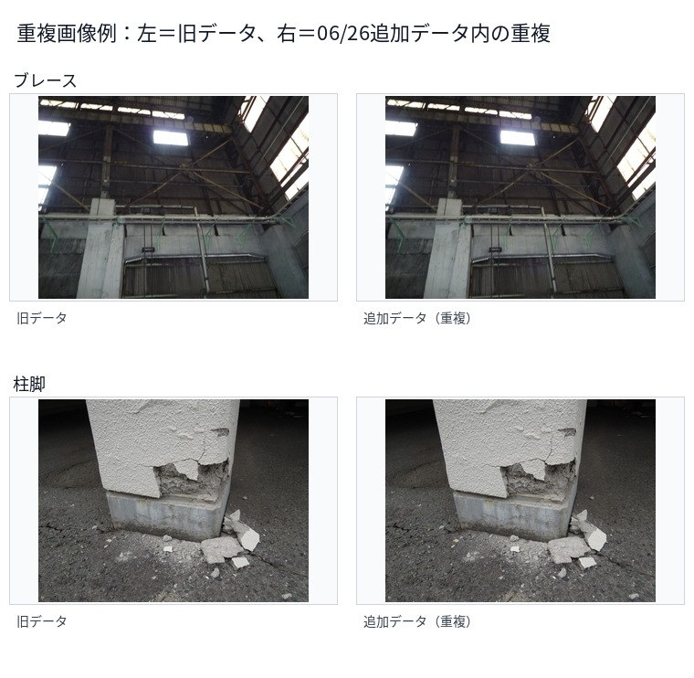
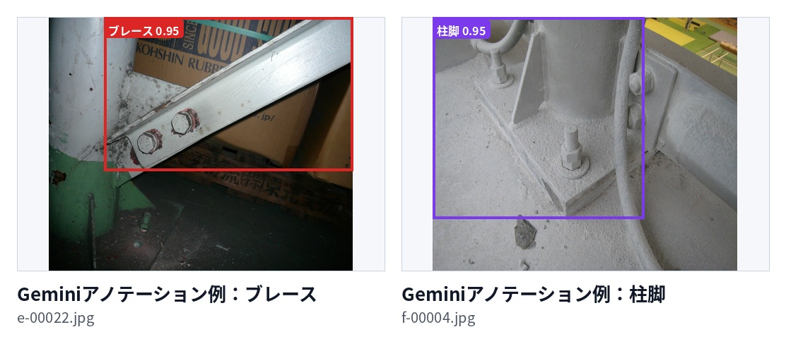
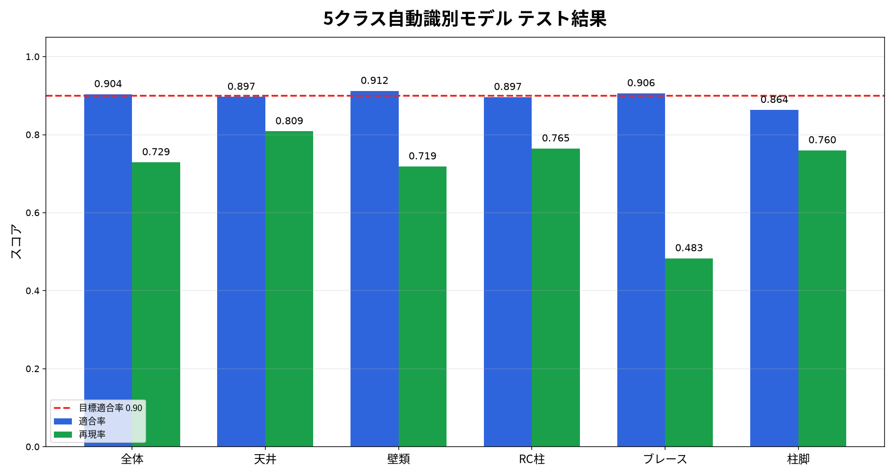
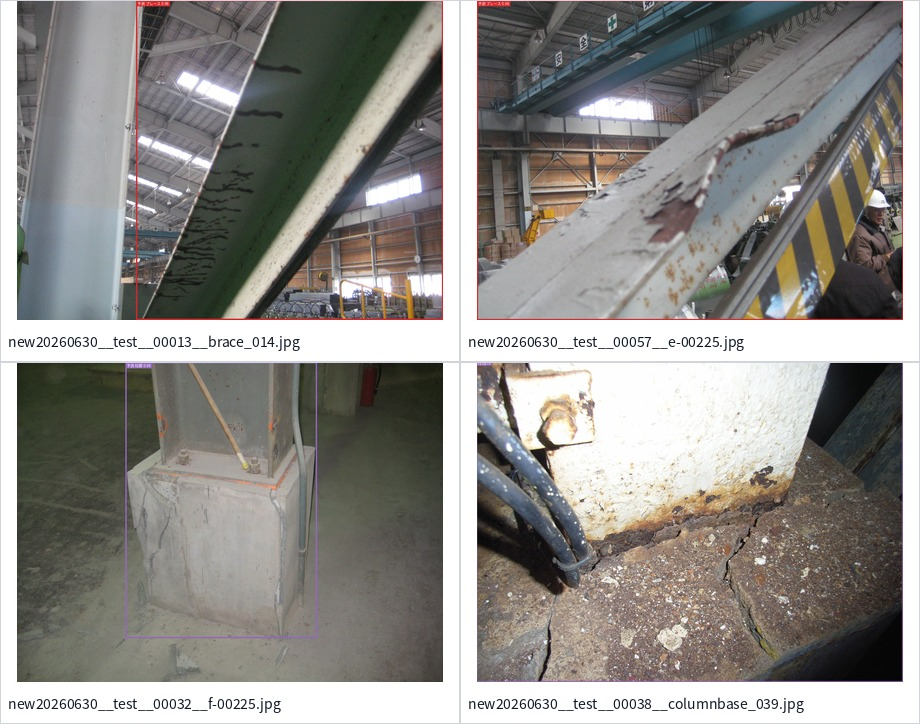
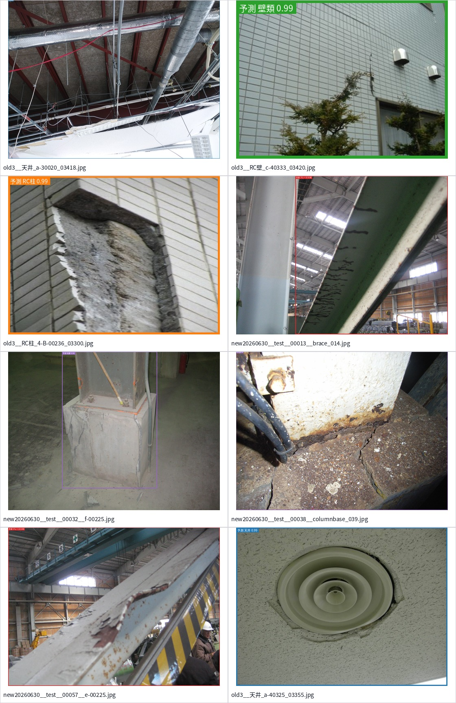
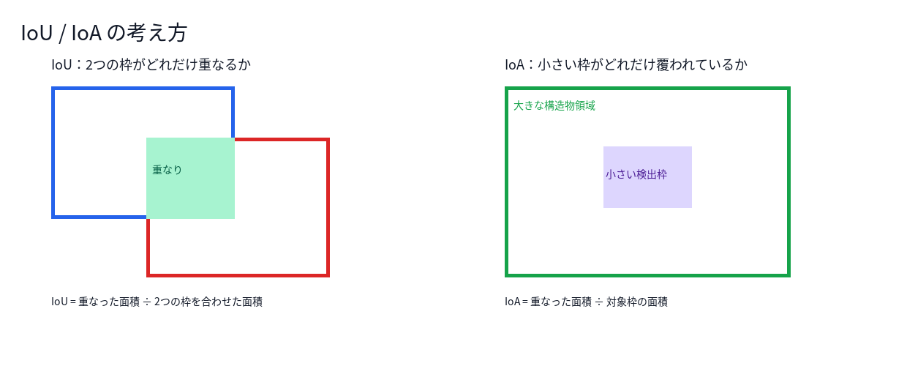
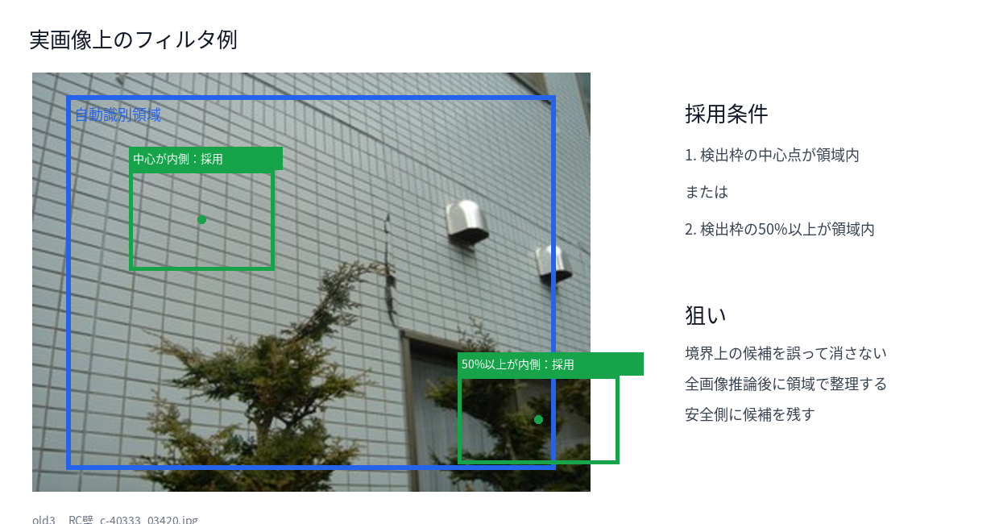
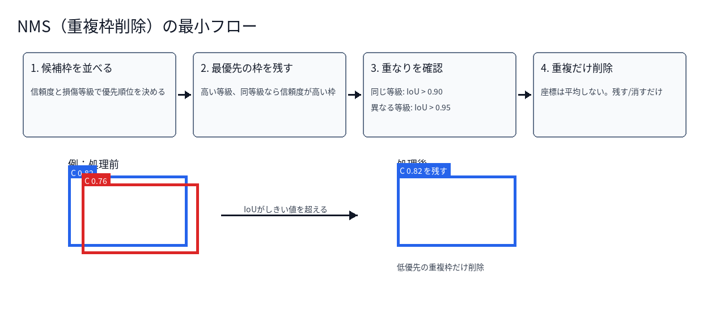
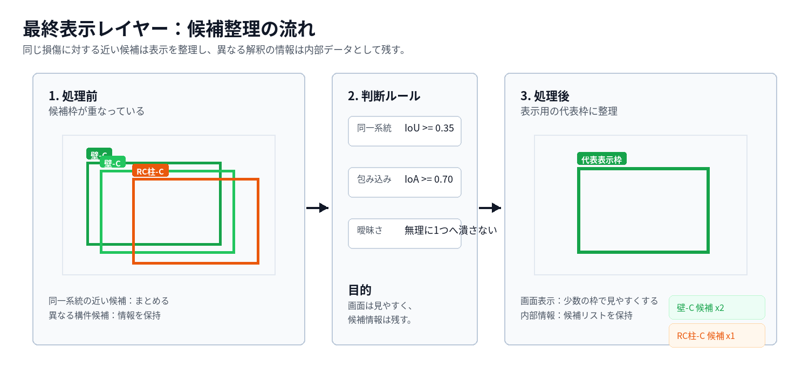

# 会议报告草稿：5 类自动识别模型训练结果与 Pipeline 合并逻辑说明

## 1. 前情提要和今日议题

### 1.1 前情提要

之前已经在 4 个既有类别上完成了完整 pipeline 构建：

- 天井
- RC壁
- RC柱
- 内壁

既有 pipeline 包含两层模型：

- 自动识别模型：判断图像中属于哪个建筑构件类别。
- 下游伤痕检测判别模型：在对应构件区域内检测 B/C/D 等级伤痕。

上周客户新增提供了两个类别的数据：

- ブレース
- 柱脚

当前这两个新增类别还没有伤痕检测用的 B/C/D 标注。因此本阶段先处理自动识别模型，将构件识别范围从既有类别扩展到新增类别。

另外，上周会议遗留事项中，还需要说明当前 pipeline 中检测框合并和去重的规则逻辑。

### 1.2 今日议题

1. 新数据概要与确认事项
2. 新数据加入后的自动识别模型训练结果
3. 当前 pipeline 中检测框合并逻辑说明

## 2. 新数据概要与确认事项

### 2.1 新增数据来源

客户提供了两个新类别的图片数据。本次数据主要用于自动识别模型训练，当前不包含下游伤痕检测所需的 B/C/D 标注。

原始解压后的图片数量如下：

| 类别 | 图片数 |
|---|---:|
| ブレース | 489 |
| 柱脚 | 410 |
| 合计 | 899 |

其中，06/26 新批次是对之前 06/03 批次的补充。两批数据之间存在重复图片，因此不能直接把文件数当作完全新增内容。

按 SHA256 精确去重后的统计如下：

| 类别 | 06/03 旧批次文件数 | 06/26 新批次文件数 | 两批重复的唯一图片内容 | 新批次中非旧批次内容文件数 |
|---|---:|---:|---:|---:|
| ブレース | 108 | 381 | 97 | 268 |
| 柱脚 | 82 | 328 | 79 | 246 |

补充说明：

- 如果只按“新批次文件数 - 两批重复的唯一图片内容”粗略估算，新增规模约为 `ブレース 284`、`柱脚 249`。
- 如果进一步考虑新批次内部重复文件，则新批次中非旧批次内容文件数为 `ブレース 268`、`柱脚 246`。
- 因此这批数据确实包含大量新内容，但也包含旧批次副本和内部重复。

重复统计文件：

```text
docs/meeting_notes/2026-07-01/assets/new_data_duplicate_summary.csv
docs/meeting_notes/2026-07-01/assets/new_data_duplicate_detail.csv
```

重复图片样例：



### 2.2 标注方式

新增图片原始数据只有类别文件夹，没有检测框标注。本次使用 Gemini 对新增类别图片进行自动标注，再用标注结果构建 5 类自动识别模型训练数据。

Gemini 标注结果概要：

| 项目 | 数值 |
|---|---:|
| 成功标注图片 | 899 |
| ブレース 图片数 | 489 |
| 柱脚 图片数 | 410 |
| 含有效 ブレース 框的图片 | 421 |
| 含有效 柱脚 框的图片 | 299 |
| 有效 ブレース 框数 | 589 |
| 有效 柱脚 框数 | 311 |
| 有效新增类别框数合计 | 900 |

这里的“有效框”指 Gemini 输出中包含对应类别，并且置信度达到训练数据构建阈值。需要注意，`421 + 299 = 720` 表示“有有效框的图片数”，不是框数；有些图片中会包含多个同类构件框，因此最终有效框数合计为 `589 + 311 = 900`。

另外，部分图片虽然 Gemini 成功返回，但返回的是其他构件类别，或者没有返回对应目录类别的框。这类图片没有进入新增类别训练标注：

| 类别 | 图片数 | 含有效同类框图片 | 未得到有效同类框图片 |
|---|---:|---:|---:|
| ブレース | 489 | 421 | 68 |
| 柱脚 | 410 | 299 | 111 |
| 合计 | 899 | 720 | 179 |

Gemini 标注样例：



## 3. 5 类自动识别模型训练

### 3.1 类别设置

本次自动识别模型从原来的构件识别扩展为 5 类：

| id | 类别 | 说明 |
|---:|---|---|
| 0 | 天井 | 既有类别 |
| 1 | 壁类 | 内壁与 RC壁 在自动识别阶段合并 |
| 2 | RC柱 | 既有类别 |
| 3 | ブレース | 新增类别 |
| 4 | 柱脚 | 新增类别 |

### 3.2 训练策略

本次采用 5 类整体重新训练，没有采用“旧 3 类模型 + 新增类别追加模型”的方式。

原因是自动识别模型位于 pipeline 入口，所有类别需要在同一个模型中互相比较和竞争。统一训练后，后续 pipeline 只需要接入一个自动识别模型，集成方式更直接，也避免多个自动识别模型之间再做冲突处理。

### 3.3 数据划分

| split | 图片数 | 天井框 | 壁类框 | RC柱框 | ブレース框 | 柱脚框 |
|---|---:|---:|---:|---:|---:|---:|
| train | 4635 | 2128 | 4172 | 1800 | 472 | 252 |
| test | 415 | 183 | 391 | 102 | 60 | 25 |

### 3.4 训练结果概要

整体结果：

| 模型 | Precision | Recall | F1 |
|---|---:|---:|---:|
| 旧 3 类自动识别模型 | 0.905 | 0.852 | 0.877 |
| 本次 5 类自动识别模型 | 0.9039 | 0.7293 | 0.8073 |

本节重点：

- 本次 5 类自动识别模型整体 Precision 达到 `0.9039`。
- 超过客户要求的 `0.90`。
- 相比旧 3 类模型，本次类别数增加，且新增类别标注来自 Gemini 自动生成；Recall 有下降，但 Precision 仍维持在目标线上。

指标可视化：



### 3.5 分类别结果

旧 3 类模型没有保存同一口径的逐类别 Precision / Recall，因此下表中旧模型对比值采用当时记录中的逐类别 AP 作为参考，写在括号内。它不等同于 Precision / Recall，但可以辅助观察旧模型在三个既有类别上的相对表现。

| 类别 | Precision | Recall | 备注 |
|---|---:|---:|---|
| 天井 | 0.8970（旧 3 类 AP: 0.829） | 0.8087 | 接近 0.90 |
| 壁类 | 0.9123（旧 3 类 AP: 0.727） | 0.7187 | 超过 0.90 |
| RC柱 | 0.8966（旧 3 类 AP: 0.791） | 0.7647 | 接近 0.90 |
| ブレース | 0.9062 | 0.4833 | Precision 达标，Recall 偏低 |
| 柱脚 | 0.8636 | 0.7600 | 后续仍有改善空间 |

旧 3 类自动识别模型的整体参考结果为 `Precision 0.905 / Recall 0.852 / F1 0.877`。本次 5 类模型在新增类别加入后，整体 Precision 仍然超过 0.90，但新增类别的稳定性还需要继续观察。

`ブレース` 的 Recall 偏低，主要的原因可能是：

- `ブレース` 形态变化较大，有斜向、细长、局部遮挡、远景等情况。
- Gemini 标注不是人工精标，部分框较大或不稳定。
- 测试集中 `ブレース` 标注框数量只有 60 个，少量漏检会明显影响 Recall。

后续如果要提高 `ブレース` Recall，建议优先做数据层面的人工抽检和补标，而不是只降低阈值。

### 3.6 结果可视化展示

下面展示测试集上两个新增类别的自动识别结果。图中为模型预测框。



完整 5 类样例：



## 4. Pipeline 中检测框合并逻辑说明

客户视角下，可以把 pipeline 的后处理理解为：

> 模型先给出多个候选框，系统再用规则把这些候选整理成更适合展示、也更不容易漏掉风险的结果。

这些规则不是替代模型判断，而是解决模型输出在实际画面中会遇到的重复、重叠、边界和显示问题。

### 4.1 为什么需要规则合并

模型原始输出不能直接作为最终显示结果，主要原因：

- 同一处损伤可能出现多个重复框。
- 不同模型可能对同一位置给出不同解释。
- 部材边界处的检测框可能跨出自动识别区域，需要更宽松的保留规则。
- 下游模型有时没有输出，需要避免最终显示为空。

本节重点是说明 pipeline 中具体的优化策略：哪些框保留、哪些框去重、哪些框合并显示。

### 4.2 IoU / IoA 的基本概念



IoU 用来表示两个框互相重叠的比例。越接近 1，表示两个框越像同一个框。它适合判断“两个检测框是不是在说同一处对象”。

IoA 用来表示一个框有多少面积被另一个框覆盖。它更适合处理“大框包小框”的情况，例如一个小损伤框落在一个大的构件区域内。

### 4.3 自动识别区域筛选

当前逻辑：

- 下游模型先对整张图片推理。
- 再用自动识别模型给出的构件区域筛选结果。
- 满足以下任一条件就保留：
  - 检测框中心点在构件区域内。
  - 检测框自身至少 50% 面积在构件区域内。

关键参数：

```text
region_filter_mode = center_or_ioa
region_filter_ioa_threshold = 0.50
```

参数含义：

- 中心点规则负责保留位置明确的检测框。
- 50% IoA 规则负责保留边界附近的检测框。
- 如果只用中心点，边界损伤容易被误删；如果完全不筛选，又会把明显不属于该构件区域的框带入后续流程。

因此，这一步是在“避免误删”和“控制误检”之间做平衡。例如损伤刚好在墙和柱、墙和天井的交界处时，检测框可能不完全落在构件区域内，但仍然应该保留。

实际图像上的说明例：



### 4.4 损伤候选的去重逻辑

当前损伤候选使用 NMS 去重。

简洁理解：

- NMS 是删除重复框。
- 当前不是坐标融合。
- 不会把多个框平均成一个新框。

NMS 的最小流程如下：



关键参数：

```text
same_grade_iou_threshold = 0.90
cross_grade_iou_threshold = 0.95
prefer_higher_grade = true
```

规则含义：

- 同等级框高度重叠时，删除重复候选。
- 不同等级框需要更高重叠度才删除，避免过早删除 B/C/D 之间的有效候选。
- 优先保留高 damage grade；同等级时保留 confidence 高的候选。
- `0.90` 和 `0.95` 都是偏保守的设置，只有两个框非常接近时才去重，因此更偏向保留风险信息，而不是过早合并。

### 4.5 最终显示层合并

最终显示层会继续整理候选：

- 同一类的相近框可以合并成较少的显示项。
- 跨类别候选不强行改判。
- 对于同一位置存在多个类别解释的情况，保留候选信息。

下面用 step-by-step 示意图说明最终显示层的整理方式：



关键参数：

```text
cluster_same_family.iou_threshold = 0.35
cluster_same_family.ioa_threshold = 0.70
collapse_ambiguity.enabled = false
```

参数影响可以这样理解：

- `iou_threshold = 0.35`：只要同类候选有一定重叠，就允许进入同一组，减少同一损伤周围出现多个显示框。
- `ioa_threshold = 0.70`：当一个框大部分被另一个框覆盖时，也允许归为同一组，适合处理大框包小框。
- `collapse_ambiguity.enabled = false`：不把有歧义的跨类别候选强行压成一个结果。

这一步的目标是减少画面混乱，但不把有歧义的类别直接删除。例如同一位置既可能是壁类，也可能是 RC柱时，系统会保留候选解释，供前端或人工确认。

## 5. 当前结论和后续事项

### 5.1 当前结论

- 5 类自动识别模型已完成训练。
- 整体 Precision 达到 `0.9039`，超过 `0.90`。
- 新增类别已经进入统一自动识别模型。
- 当前新增类别只完成自动识别阶段，还没有下游伤痕检测模型。
- Pipeline 合并逻辑可以分层解释，并且每层都有明确参数。

### 5.2 后续事项

等待新类别的伤痕判别数据标注完成后，着手训练两个新增类别的下游伤痕检测模型。

在等待下游标注期间，可以继续优化 `ブレース` 的 Recall。当前初步判断，问题更偏向数据本身：

- `ブレース` 的形态和拍摄角度变化较大。
- Gemini 自动框对细长斜向构件的边界不够稳定。
- 有效训练框数量仍然偏少。
- 测试集样本量较小，指标波动会比较明显。

因此下一步建议优先做 `ブレース` 的人工抽检、修正部分 Gemini 标注框，并补充更典型的远景、遮挡、斜向构件样本。完成这些后，再重新训练或做类别独立阈值调优。
