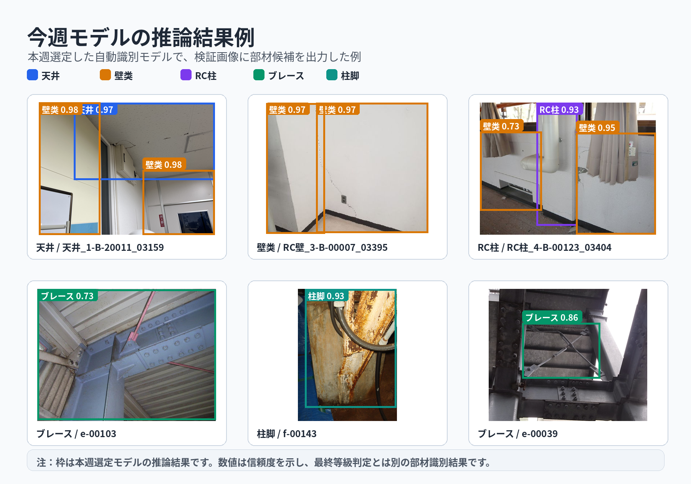
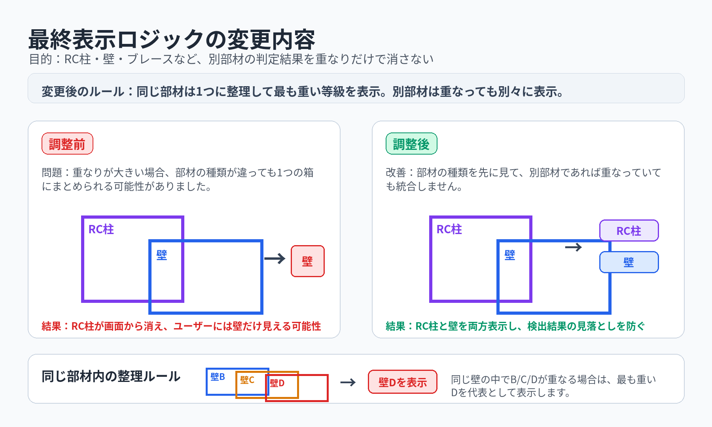

# 本周工作进度报告

日期：2026-07-07
对象：清水建设项目相关客户说明用

## 一、本周结论

本周的工作重点是围绕新增部材数据、自动识别模型性能和最终展示规则三方面推进。面向客户说明时，可概括为以下三项进展：

1. **ブレース、柱脚 数据已进入人工复核流程**
   本周对新增两类部材的数据进行了人工复核整理。
   【此处可补充：复核范围、样本数量、主要确认事项、发现的问题和后续处理方针。】

2. **重新训练了自动识别模型，并在保持 0.9 Precision 的前提下改善 ブレース 表现**
   上周 ブレース 的 Recall 较低，主要原因是 Gemini 自动标注得到的 ブレース 数据质量不够稳定。本周对相关数据进行人工复核和修正后，重新训练自动识别模型。最终候选模型整体 Precision 达到 **0.900**，同时 ブレース Recall 从上周的 **0.483** 提升到 **0.744**。

3. **根据上周会议要求，最终展示层规则已完成调整**
   新规则是：**同一部材内部可以合并并取最严重等级，不同部材之间即使重叠也不合并**。这样可以避免现场照片中 RC 柱、墙、ブレース 等部材互相重叠时，其中一个结果在最终画面中被吞掉。

## 二、数据人工复核

本周对 ブレース、柱脚 两类新增部材数据进行了人工复核整理。该部分的详细内容建议在客户汇报前补入最终数字和复核结论。

建议补充内容如下：

| 项目 | 本周记录 |
|---|---|
| 复核对象 | ブレース、柱脚 |
| 复核范围 | 【待补充：数据来源、样本数量、是否包含训练/验证/测试集】 |
| 主要确认事项 | 【待补充：类别是否正确、框位置是否合理、重复数据或低质量样本处理】 |
| 复核后的处理 | 【待补充：保留、修正、删除或等待客户确认的数据】 |
| 对模型训练的影响 | 人工复核后的数据已用于本周自动识别模型重新训练 |

客户侧需要理解的是：新增两类部材的识别能力，首先取决于输入数据是否可靠。人工复核的目的不是单纯增加数据量，而是保证模型看到的是“正确类别、正确位置、可用于学习”的样本。

## 三、自动识别模型重新训练结果

本周使用人工复核后的数据重新训练自动识别模型，并重点关注 ブレース 的改善。评估策略仍然以 **Precision 0.9** 作为目标线，同时确认各类别 Recall 不出现明显短板。

上周版本中，ブレース 的 Recall 明显偏低。主要原因是当时用于扩展新类别的数据中，Gemini 自动标注的 ブレース 样本质量不够稳定，存在类别判断和框位置不够准确的问题。模型在这部分数据上学习后，对 ブレース 的拾取能力受到影响。

本周对相关数据进行了人工复核和修正，并重新训练自动识别模型。与上周结果相比，本周结果如下：

| 指标 | 上周结果 | 本周候选 | 简单结论 |
|---|---:|---:|---|
| 天井 Precision / Recall / F1 | 0.8970 / 0.8087 / 0.8506 | 0.9441 / 0.7377 / 0.8282 | Precision 提升，Recall 有所下降 |
| 壁类 Precision / Recall / F1 | 0.9123 / 0.7187 / 0.8040 | 0.8836 / 0.7187 / 0.7927 | Recall 基本持平 |
| RC柱 Precision / Recall / F1 | 0.8966 / 0.7647 / 0.8254 | 0.9036 / 0.7353 / 0.8108 | 整体仍在可验证范围 |
| ブレース Precision / Recall / F1 | 0.9062 / 0.4833 / 0.6304 | 0.8000 / 0.7442 / 0.7711 | 数据修正后，Recall 和 F1 明显改善 |
| 柱脚 Precision / Recall / F1 | 0.8636 / 0.7600 / 0.8085 | 1.0000 / 0.8485 / 0.9180 | Precision、Recall、F1 均改善 |
| Overall Precision / Recall / F1 | - | 0.900 / 0.733 / 0.808 | 本周整体 Precision 达到 0.9 目标 |

本周的简单结论是：**上周主要问题在于 Gemini 自动标注的 ブレース 数据质量不足，导致 ブレース Recall 偏低；本周经过人工复核和修正后，ブレース Recall 从 0.483 提升到 0.744，F1 从 0.630 提升到 0.771**。因此，本周候选模型可以作为当前阶段的自动识别模型版本，进入后续 Pipeline 和 UI 对接验证。

下面是本周候选模型在验证图片上的推理结果示例。图中彩色框为模型输出的部材候选，数字为模型置信度；该结果表示“识别到了什么部材”，不代表最终 BCD 等级判定。

## 四、最终展示层合并逻辑调整

本周根据会议反馈，已调整最终展示层的合并逻辑。

之前的问题是：如果两个检测框重叠度较高，系统可能不区分它们是否属于同一类部材，直接合并成一个结果。这样在现场照片中会造成一个明显问题：例如 RC 柱和墙在画面上真实重叠时，最终展示可能只保留“墙”或只保留“柱”，另一个结果会被吞掉。

新的展示规则如下：

| 情况 | 新处理方式 | 目的 |
|---|---|---|
| 同一部材内部重叠 | 合并，并采用最严重等级 | 减少重复框，让画面更简洁 |
| 不同部材之间重叠 | 不合并，各自保留 | 避免柱、墙、ブレース等结果互相覆盖 |

一句话概括就是：**类内取最重，类间不合并**。

这项调整的客户价值是：最终画面更符合现场理解。现场确实可能同时存在墙、柱、斜撑等多个部材，它们在二维照片里发生重叠是正常现象，系统不应因为重叠就删除其中一个部材。

## 五、当前总结与后续等待事项

当前阶段可以总结为：

1. **自动识别模型训练已告一段落**
   本周候选模型已经达到 Precision 0.9 目标，并改善了 ブレース 的表现。后续重点不再是无限制继续试模型，而是把该版本放入 Pipeline 中做整体验证。

2. **Pipeline 整理和 UI 对接正在执行**
   当前已完成 Pipeline API 初版设计和后端骨架整理，最终展示层合并规则也已按会议要求调整。下一步重点是让识别结果、展示规则和 UI 画面连起来验证。

3. **现在主要等待客户侧标注数据**
   ブレース、柱脚 的自动识别已经进入当前模型范围，但它们下游的 BCD 等级判定仍需要客户侧标注数据。收到标注后，才能继续训练这两类的等级判定模型，并把结果正式纳入完整 Pipeline。
