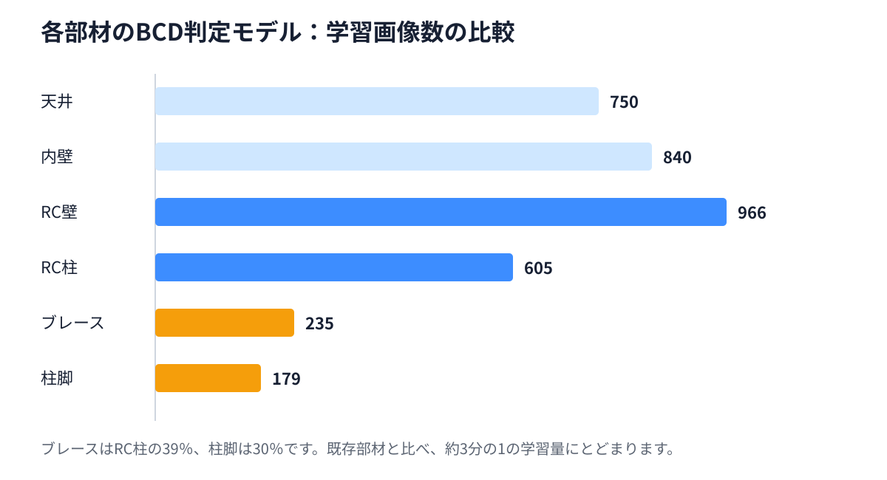
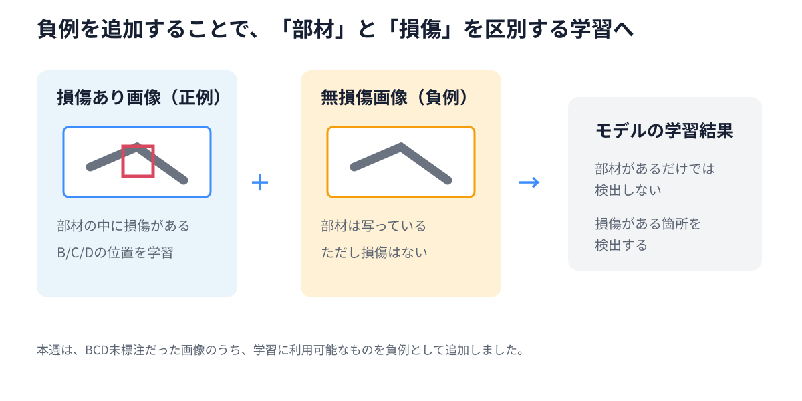
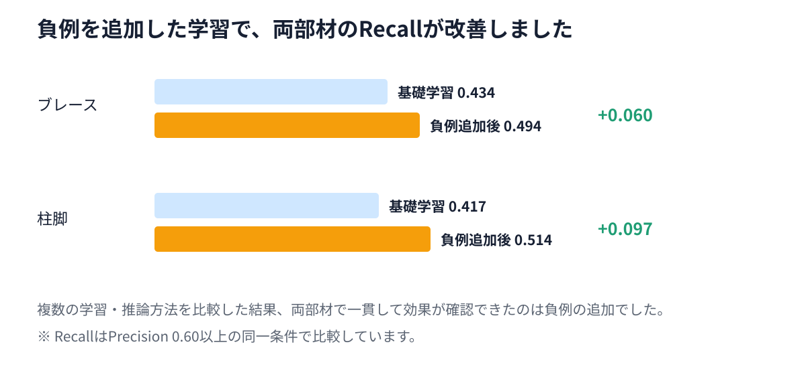
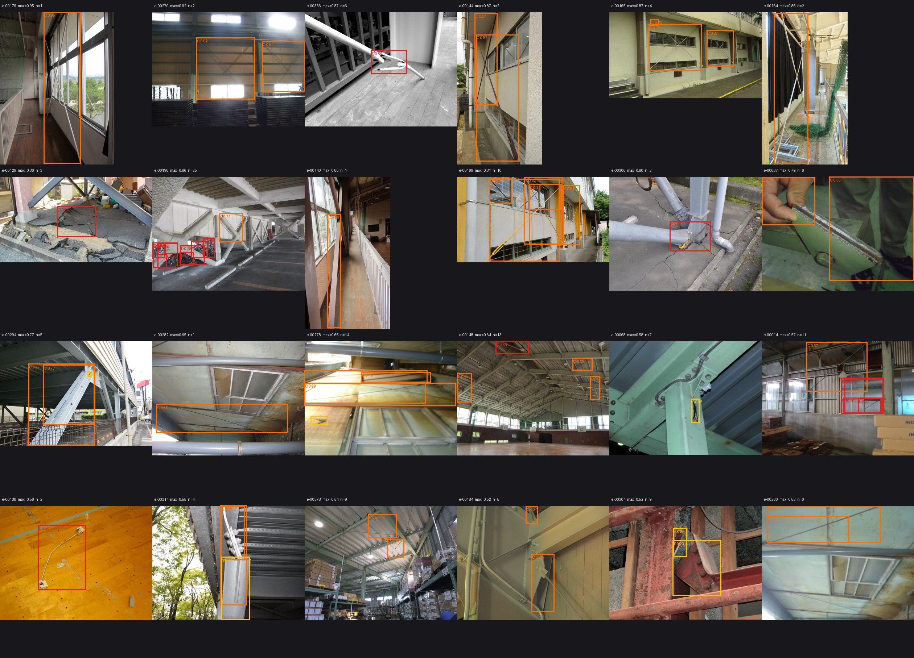
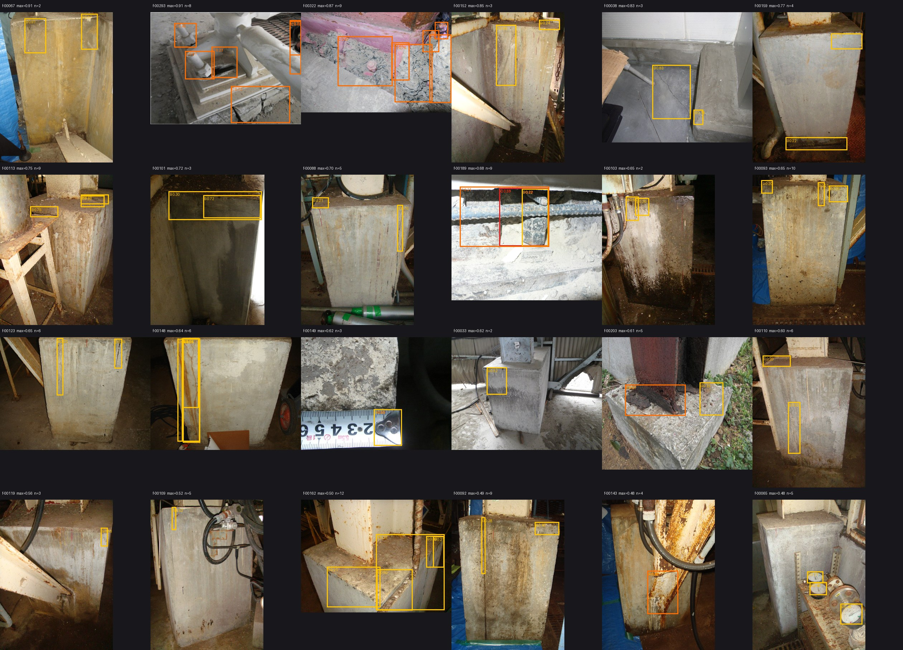

# 週次進捗報告：ブレース・柱脚 損傷判定モデル

日付：2026年7月28日  
対象：清水建設様向け ご説明資料

## 1. 今週の要点

今週は、ブレース・柱脚の損傷判定モデルについて、提供データの整理、基礎学習、負例を追加した学習、および結果確認を進めました。お客様にご確認いただきたいポイントは、以下の3点です。

1. **ブレース・柱脚の学習データを精査し、損傷判定用に整理しました**  
   提供データの画像とラベルを対応付け、重複画像を整理したうえで、ブレース・柱脚それぞれの損傷判定モデル用データセットを作成しました。

2. **基礎学習後に複数の改善方法を比較し、負例学習の有効性を確認しました**  
   基礎学習では十分な判定精度が得られなかったため、複数の改善方法を比較しました。その結果、BCD未標注だった画像の一部を「無損傷の部材画像」として学習に追加する方法が、両部材で最も安定した改善につながりました。

3. **現在の主な課題は、既存部材と比べて学習データが少ないことです**  
   ブレース・柱脚の有効な学習画像数は、既存の近い部材と比べて約3分の1です。より安定した判定のため、追加の実データが必要です。

## 2. ブレース・柱脚データの整理

ブレース・柱脚は、既存の天井・内壁・RC壁・RC柱に続く、新しい損傷判定対象です。今週は、提供された画像と B/C/D ラベルを確認し、重複を整理したうえで、学習・評価に使用するデータを固定しました。

| 項目 | ブレース | 柱脚 |
|---|---:|---:|
| 提供された標注画像 | 381枚 | 328枚 |
| 重複整理後の画像 | 352枚 | 306枚 |
| B/C/D標注を持つ画像 | 293枚 | 224枚 |
| 学習に使用した画像 | 235枚 | 179枚 |
| 評価に使用した画像 | 58枚 | 45枚 |

今回の作業の目的は、単にデータを増やすことではありません。画像と B/C/D ラベルを正しく対応付け、同じ写真が学習と評価に重ならないようにすることで、モデルの結果を正しく比較できる状態に整えました。

### 6部材の学習データ量の比較



| 部材 | 学習画像数 |
|---|---:|
| 天井 | 750枚 |
| 内壁 | 840枚 |
| RC壁 | 966枚 |
| RC柱 | 605枚 |
| ブレース | **235枚** |
| 柱脚 | **179枚** |

ブレースは RC柱の約39%、柱脚は約30%の学習画像数です。今回の2部材は、6部材全体の中でも特にデータ量が少なく、現場・撮影距離・角度・照明・損傷形態の幅を十分に学習できていないことが、現在の課題につながっています。

## 3. 損傷判定モデルの学習

```text
自動識別モデル：写真内の部材を識別
    ↓
ブレース 損傷判定モデル
柱脚 損傷判定モデル
```

### 1. 基礎学習

まず、B/C/D の標注が付いた画像を使用して、ブレース・柱脚それぞれの基礎学習を行いました。基礎学習の結果を確認したところ、損傷だけでなく、部材の構造や表面にも反応する傾向が見られました。

### 2. 改善方法の比較

基礎学習の結果をもとに、損失関数、画像拡張、推論方法など、複数の改善方法を比較しました。その結果、両部材で一貫して改善を確認できたのは、無損傷画像を活用する方法でした。

### 3. 負例を追加した学習

負例とは、「部材は写っているが、損傷は写っていない」画像です。損傷がある画像だけで学習すると、モデルは部材そのものを損傷として捉えやすくなります。無損傷の部材画像も一緒に学習させることで、部材の存在ではなく、損傷の有無を区別しやすくなります。



本週は、BCD標注のない画像のうち、学習に利用可能なものを負例として追加しました。複数の学習・推論方法を試した中で、この方法がブレース・柱脚の両方に対して最も安定した改善を示しました。

## 4. 損傷判定モデルの確認結果

基礎学習と負例を追加した学習を比較した結果、両部材で Recall の改善を確認しました。

| 部材 | 基礎学習 Recall | 負例追加後 Recall | 改善幅 |
|---|---:|---:|---:|
| ブレース | 0.434 | **0.494** | **+0.060** |
| 柱脚 | 0.417 | **0.514** | **+0.097** |



今回の比較では、損失関数、画像拡張、推論方法など複数の方法を試しました。その中で、ブレース・柱脚の両方で一貫して改善を確認できたのは、無損傷画像を活用した負例学習でした。

## 5. 現在の課題と要因分析

現在の課題は、モデルが損傷そのものだけでなく、部材の構造、部材境界、表面の模様や錆などにも反応しやすいことです。

背景には、今回の学習データが少ないことに加え、損傷あり・損傷なしの状態や撮影条件のバリエーションが十分ではないことがあります。損傷ありの画像だけでは、モデルが「部材があること」と「損傷があること」を区別しにくくなります。

以下は、BCD未標注画像に対する確認例です。部材の構造や表面を損傷候補として検出している例が見られます。

### ブレースの確認例



### 柱脚の確認例



負例を追加した学習により、このような不要な検出は減少しました。ただし、現在のデータ量では、すべての現場条件・損傷形態を十分にカバーすることは難しいため、追加データによる改善が必要です。

## 6. 改善提案

### 1. 追加の実データをご提供いただく

最も優先度が高い改善提案は、ブレース・柱脚の実データを追加することです。特に、以下のデータをご提供いただけると、学習の安定化に有効です。

1. B/C/D の損傷が写ったブレース・柱脚の写真。
2. 損傷がないことを確認できるブレース・柱脚の写真。
3. 異なる現場、距離、角度、照明条件で撮影された写真。

無損傷の写真は B/C/D の等級付けが不要で、部材に損傷がないことを確認いただければ活用できます。今回の負例学習の結果からも、こうしたデータは誤検出の抑制に特に有効です。

### 2. 合成データを追加した学習を来週実施する

実データの追加と並行して、来週はブレース・柱脚の合成データを追加した学習を試行します。

進め方は以下のとおりです。

1. ブレース・柱脚の損傷パターンを含む合成画像を作成する。
2. 画像品質を確認し、学習に適さない画像を除外する。
3. 実データと合成データを組み合わせて追加学習する。
4. 今回と同じ評価データで、実データのみの場合と結果を比較する。

合成データは、現在不足している損傷形態や撮影条件の幅を補うための改善提案です。次回は、実データのみの場合と比較した結果をご報告します。
