# 自动识别模型接入裂缝检测流程汇报故事线

日期：2026-05-19

## Part 1. 工作全景与结论

根据上一次会议的意见，本期将外观上容易混淆的 `RC壁` 与 `内壁` 合并为同一个 `壁类`，训练了自动识别建筑区域的模型，并将该模型合并到上一期的自动化裂缝等级识别流程中。

```text
用户上传照片
  -> 自动识别建筑区域
      天井 / 壁类 / RC柱
  -> 根据区域类别调用裂缝等级模型
      天井 -> 天井裂缝模型
      壁类 -> 内壁裂缝模型 + RC壁裂缝模型
      RC柱 -> RC柱裂缝模型
  -> 只保留对应建筑区域内的裂缝结果
  -> 对重复结果进行合并
  -> 输出裂缝位置和 B/C/D 等级
```

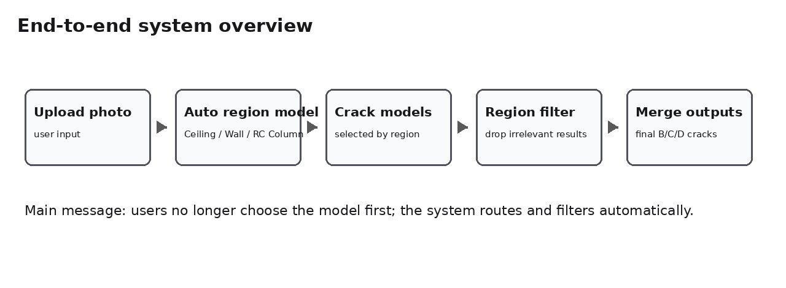

当前最重要的结论是：这个方向可以减少用户手动选择模型的负担，也能减少多个模型同时识别整张照片时产生的无关误检。对 80 张抽样图片的端到端对比中，无关误检从 `112` 降到 `77`，说明自动区域过滤确实有效。

同时，自动识别模型本身已经具备进入流程验证的基础能力。当前最好模型在独立测试集上的整体 `P=0.843 / R=0.841 / mAP50=0.888`。其中：

- `P` 可以理解为“模型框出来的区域里，有多少是真的”。
- `R` 可以理解为“真实存在的区域里，有多少被模型找到了”。
- `mAP50` 可以理解为“综合考虑框的位置和类别后，模型整体识别质量的分数”。

不过，自动识别还不是 100%。剩余约 15%-20% 的识别缺口会传导到后续裂缝检测，主要表现为 `RC柱` 与 `壁类` 的混淆。当前端到端对比中，上一期的单模型整图方式可匹配 `72/92` 个主分支裂缝，接入自动识别后为 `66/92`，损失主要集中在 RC柱样本。

## Part 2. 自动识别模型训练

### 2.1 数据集构成

数据集来自之前的裂缝识别数据，并对全部图片重新进行了 Gemini 标注。根据上一次会议共识，`RC壁` 与 `内壁` 在自动识别阶段合并为 `壁类`，因为二者在照片外观上很难稳定区分；如果强行要求模型区分，等于让模型判断照片中不可见的结构信息，结果会不稳定。

原始四类裂缝数据规模如下：

| 原始类别 | 图片数 | 裂缝标注框数 | 自动识别阶段处理 |
|---|---:|---:|---|
| 天井 | 943 | 1023 | 保持为 `天井` |
| 内壁 | 1058 | 1218 | 合并为 `壁类` |
| RC壁 | 1182 | 1480 | 合并为 `壁类` |
| RC柱 | 636 | 679 | 保持为 `RC柱` |
| 合计 | 3819 | 4400 | 训练为三类建筑区域 |

经过 Gemini 建筑区域标注和类别合并后，自动识别训练数据为：

| 自动识别类别 | 标注框数 |
|---|---:|
| 天井 | 1902 |
| 壁类 | 3785 |
| RC柱 | 948 |
| 合计 | 6635 |

类别示例：

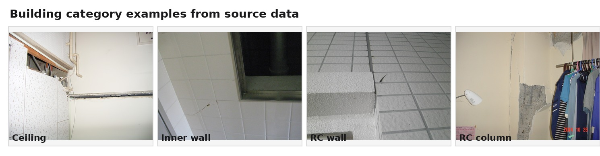

这张图的汇报重点是：`内壁` 与 `RC壁` 在外观上很接近，因此在自动识别阶段合并为 `壁类`；而 `天井` 与 `RC柱` 仍保留为独立类别。

### 2.2 数据检查与清洗

清洗目标不是“让数据变少”，而是先量化标注质量，再把明显可疑的数据从干净训练集里分离出来，避免错误标注影响模型。

本次清洗逻辑：

- 根据 Gemini 返回结果、框大小、框位置、类别一致性等规则给样本打分。
- 高分样本进入 `cleaned` 数据集，作为主要训练版本。
- 低分或明显异常样本保留在 `full` 数据集中，并标记为需要人工确认。
- 最终同时保留 `full` 和 `cleaned` 两套数据，方便后续对比。

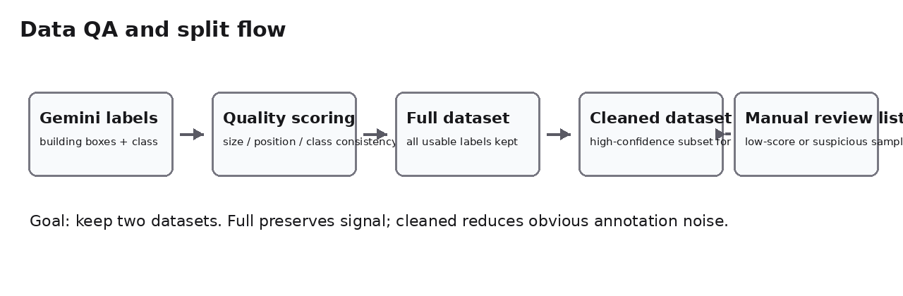

清洗后用于训练的三类合并数据规模为 `3497` 张图片、`6635` 个建筑区域标注框。训练集、验证集、测试集中的类别分布如下：

| 数据划分 | 天井 | 壁类 | RC柱 |
|---|---:|---:|---:|
| train | 1531 | 2995 | 761 |
| val | 188 | 399 | 85 |
| test | 183 | 391 | 102 |

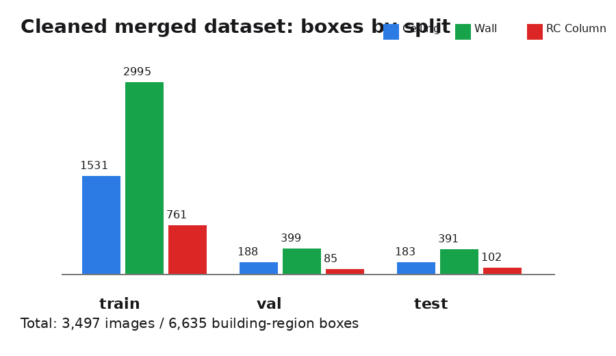

高分与低分样本示例：

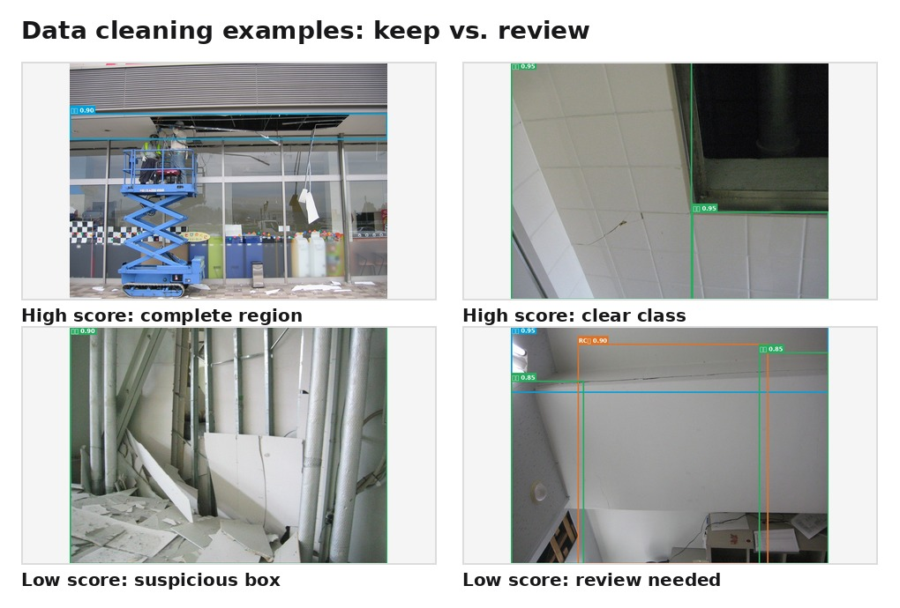

### 2.3 对照训练：full 与 cleaned

对照训练的目的是确认数据清洗是否真的有效。汇报时重点展示核心指标即可：

| 数据集版本 | Precision | Recall | mAP@0.5 | mAP@0.5:0.95 | 结论 |
|---|---:|---:|---:|---:|---|
| full | 0.71981 | 0.59097 | 0.69483 | 0.54370 | 保留更多数据，综合定位分数略高 |
| cleaned | 0.75379 | 0.58129 | 0.69721 | 0.52449 | 误判更少，作为后续调优基础更稳 |

指标说明：

- `P` 高，说明模型框出来的建筑区域更少误判。
- `R` 高，说明真实建筑区域更少漏掉。
- `mAP50` 高，说明模型综合识别质量更好。

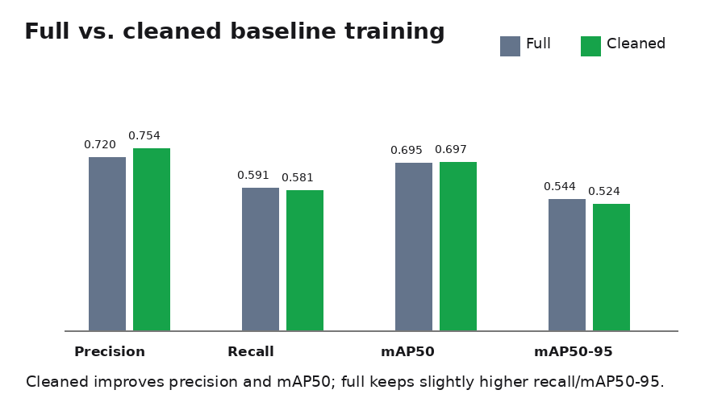

结论：数据清洗有效。`cleaned` 相比 `full`，Precision 从 `0.71981` 提升到 `0.75379`，mAP@0.5 也略有提升，说明清洗后模型框出的建筑区域更可靠。后续 RC柱 调优以 `cleaned` 为基础继续推进。

### 2.4 RC柱短板与改善

RC柱是自动识别中最困难的一类，主要原因是数据量较少、场景变化大，并且很多 RC柱与墙面、窗边、走廊边缘连在一起，肉眼上也容易像壁类。

我们针对 RC柱 做了训练策略调整，包括提高 RC柱 样本在训练中的出现比例、使用更适合类别不均衡的训练设置，并持续对比独立测试集结果。

| 版本 | 改进内容 | 整体 P/R/mAP50 | RC柱 P/R/mAP50 | 端到端 RC柱 命中 |
|---|---|---|---|---|
| baseline cleaned | 清洗数据基础模型 | 0.627 / 0.653 / 0.694 | 0.542 / 0.474 / 0.547 | 13/20 |
| B image-weights | 提高难样本训练权重 | 0.680 / 0.708 / 0.745 | 0.618 / 0.561 / 0.623 | 仍需进一步改善 |
| C RC oversample | 增加 RC柱 样本出现比例 | 0.641 / 0.684 / 0.733 | 0.514 / 0.544 / 0.609 | RC柱 召回有改善但精度不足 |
| D800 | image-weights + RC柱 适度扩增 | 0.711 / 0.670 / 0.731 | 0.648 / 0.579 / 0.620 | 综合不如 D900 |
| D900 | image-weights + RC柱 扩增到 900 | 0.753 / 0.673 / 0.761 | 0.666 / 0.596 / 0.664 | 16/20 |
| 当前最好版本 | D900 策略 + 追加数据后继续训练 | 0.843 / 0.841 / 0.888 | 0.888 / 0.853 / 0.905 | 后续继续扩大端到端验证 |

结论：RC柱 指标已经有明显改善。虽然 RC柱 仍是端到端流程中最需要关注的类别，但从模型训练指标上看，追加调优是有效的。

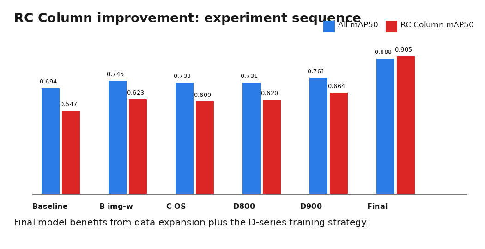

### 2.5 RC壁/内壁等级差异问题

用户关心的问题是：同一条裂缝在 RC壁 上可能判为 B，但在内壁上可能判为 C。这个问题确实需要单独说明，因为我们在自动识别阶段把两者合并为了 `壁类`。

当前处理逻辑：

- 自动识别阶段只判断是否属于 `壁类`，不强行区分 `RC壁` 和 `内壁`。
- 当识别为 `壁类` 后，同时保留内壁裂缝模型和 RC壁裂缝模型的候选结果。
- 如果两个模型对同一区域给出重叠裂缝结果，先记录二者等级差异，再按合并规则输出结果。
- 对于等级不一致的情况，后续应结合业务规则或 UI 确认来决定最终采用哪个模型结果。 

当前抽样观察中，壁类候选结果有 `289` 组可比较的重叠结果，其中 `186` 组等级一致，约占 `64%`。其余样本存在 1-2 个等级的差异，说明用户担心的问题确实存在，但不是所有样本都会发生。

建议展示 3 个案例：

| 案例 | 现象 | 汇报重点 |
|---|---|---|
| 等级一致案例 | 内壁模型与 RC壁模型都给出同等级 | 合并壁类不会必然造成等级冲突 |
| RC壁等级更高案例 | 同一区域 RC壁模型等级高于内壁模型 | 需要业务规则决定保守输出还是提示用户 |
| 内壁等级更高案例 | 同一区域内壁模型等级高于 RC壁模型 | UI 确认可以避免自动选择造成误解 |

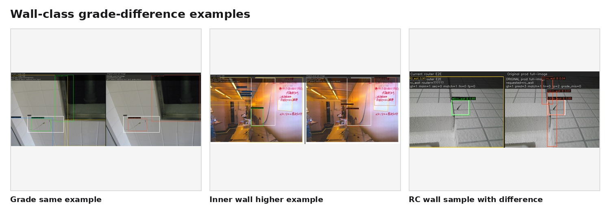

### 2.6 Part 2 小结

在当前样本规模并不大的情况下，自动识别模型已经达到可以接入完整流程验证的水平。它仍有缺陷，尤其是 RC柱 与壁类边界样本，但从数据清洗、类别合并和针对性调优后的指标看，方向是成立的。

## Part 3. 对接完整流程

### 3.1 初版局部图片方式

初版流程是：

```text
自动识别模型检出建筑区域
  -> 截取该区域为局部图片
  -> 把局部图片送给对应裂缝等级模型
  -> 将结果映射回原图
```

该方案的问题是：裂缝模型看到的图片内容发生了变化。原来模型看的是整张图，现在只看局部图片，边界附近的裂缝可能被截断，尺度和上下文也会改变。这会导致同一个裂缝模型，在同一张照片的同一区域上，给出和上一期整图方式不完全一致的结果。

另外，当一张图片中自动识别出多个建筑区域时，多个局部图片会产生重复候选框，后续合并难度也会增加。

局部图片方式示意：

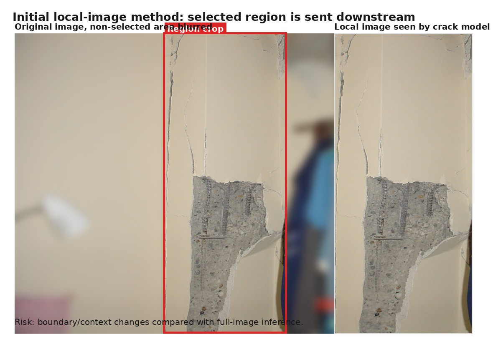

同一样本下，局部图片方式与整图过滤方式的输出差异：

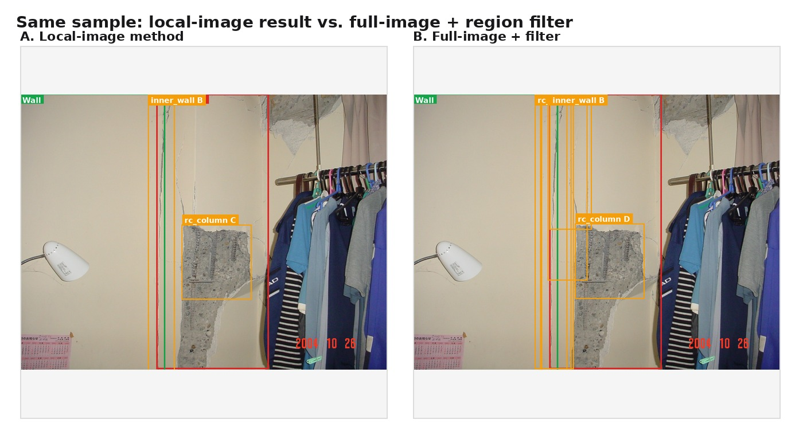

### 3.2 整图识别 + 区域过滤 + 结果合并

为解决局部图片带来的边界和尺度问题，我们改成：

```text
自动识别模型只负责给出建筑区域框
裂缝等级模型仍然看整张图片
最后只保留落在对应建筑区域框内的裂缝结果
```

示意图 1：整图识别与区域过滤

```text
原图
  +--------------------------------+
  |                                |
  |   [自动识别出的 RC柱 区域]      |
  |        x 裂缝结果保留          |
  |                                |
  |   其他区域的误检结果丢弃        |
  |                                |
  +--------------------------------+
```

示意图 2：重复结果合并

```text
同一模型输出：
  B框  +---------+
       |         |
       +---------+
  C框       +---------+
            |         |
            +---------+

如果两个框高度重叠：
  -> 合并为一个结果
  -> 优先保留更高等级或更可信的结果
```

示意图 3：多个建筑区域重叠时的处理

```text
自动识别区域允许重叠：
  区域A +------------+
       |            |
       |      +------------+ 区域B
       |      |     |      |
       +------|-----+      |
              +------------+

建筑区域重叠本身不强行删除。
真正需要合并的是裂缝模型输出的重复结果。
```

合并逻辑示意：

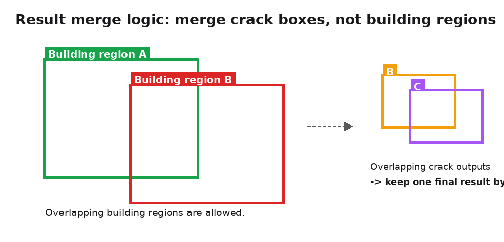

当前对比结果：

| 流程 | 主分支匹配 | FN | FP |
|---|---:|---:|---:|
| 上一期单模型整图方式 | 72/92 | 20 | 112 |
| 自动识别 + 整图识别 + 区域过滤 + 同模型合并 | 66/92 | 26 | 77 |

指标说明：

- `主分支匹配`：原始标注中存在的裂缝，有多少被正确找到。
- `FN`：原始标注中有，但系统没有找到的裂缝。
- `FP`：系统找到了，但原始标注中没有对应对象的结果。

结论：

- FP 从 `112` 降到 `77`，说明无关区域误检明显减少。
- 主分支匹配从 `72/92` 降到 `66/92`，说明自动识别错误会带来一部分漏检。
- 这符合当前系统结构的预期：自动识别带来更清爽的输出，但如果区域类别没识别对，下游模型就可能被错误过滤。

### 3.3 剩余问题深挖

我们进一步分析了“上一期单模型整图方式能匹配，但接入自动识别后没匹配”的样本。共发现 `6` 个损失匹配，其中 `5` 个来自自动识别没有输出期望类别，`1` 个来自区域过滤的几何覆盖不足。

| 图片 | 原始类别 | 裂缝等级 | 自动识别输出 | 原因 |
|---|---|---|---|---|
| `3-C-00039.jpg` | RC壁 | C | 只输出 RC柱 | 期望 `壁类`，但自动识别类别错了 |
| `d-173.jpg` | RC柱 | B | 天井 / 壁类 / 壁类 | 期望 `RC柱`，但没有识别出 RC柱 |
| `d-173.jpg` | RC柱 | B | 天井 / 壁类 / 壁类 | 同图第二个 RC柱 裂缝，同样因类别缺失被过滤 |
| `d-10022.JPG` | RC柱 | D | RC柱 / 壁类 | 有 RC柱 框，但覆盖不到该裂缝区域 |
| `d-40044.JPG` | RC柱 | B | 壁类 / 壁类 | RC柱 被识别成壁类 |
| `4-C-00022.jpg` | RC柱 | C | 壁类 / 壁类 | RC柱 被识别成壁类 |

可视化材料：

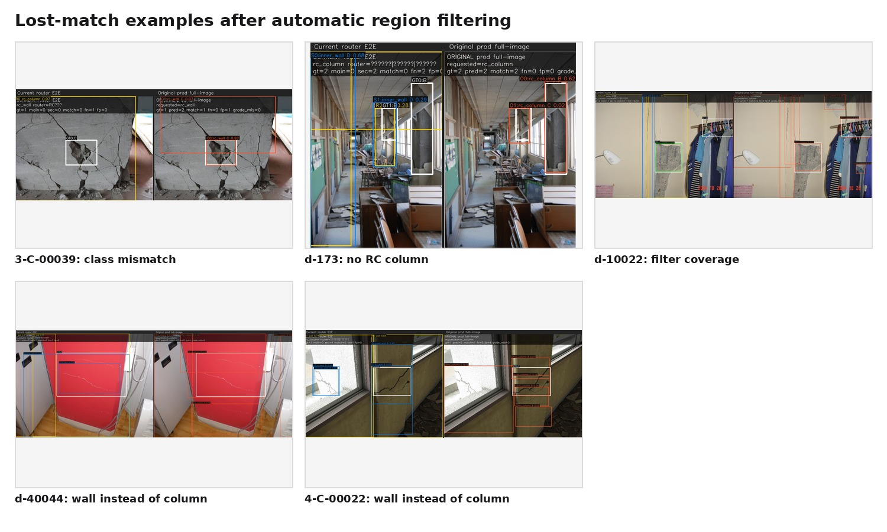

这说明当前主要瓶颈不是裂缝等级模型本身，也不是整图识别方式本身，而是自动识别类别没有命中，尤其是 RC柱 被识别成壁类的样本。

## Part 4. 遗留问题与改善方向

### 4.1 模型侧改善

后续模型侧可以从两条线推进：

1. 考虑补充 AI 合成类数据，重点覆盖 RC柱 与壁类容易混淆的场景，例如墙柱边界、窗边、走廊边缘、柱体不明显、柱体只占局部画面的样本。
2. 用规则方式优化最终输出，而不是简单无条件增加更多模型结果。例如：当自动识别置信度中等、且 RC柱/壁类混淆风险较高时，可以保留候选结果作为辅助信息，但不直接把所有结果混在最终输出中。

这部分需要继续验证，尤其要避免为了找回少量 FN，重新引入大量 FP，导致用户看到的结果再次变乱。

### 4.2 UI / 产品策略提案

建议在 UI 中增加“自动识别区域确认”步骤。前提是用户拍摄并上传照片后，系统先展示自动识别出的建筑区域和类别：

```text
用户上传照片
  -> 系统自动框出建筑区域
  -> 显示类别：天井 / 壁类 / RC柱
  -> 用户确认或手动修改
  -> 再输出最终裂缝等级结果
```

这样做的好处：

- 默认情况下用户不需要手动选择模型。
- 如果自动识别错了，用户可以在裂缝等级输出前纠正。
- 避免自动识别错误直接传导到最终裂缝结果。
- 也避免回到“多个模型同时识别整张图，结果很乱”的旧问题。

## 汇报主线总结

本期已经完成从自动识别模型训练到端到端接入的闭环验证。当前系统可以减少用户手动选择模型，并显著降低无关区域带来的误检。主要遗留问题集中在 RC柱 与壁类混淆，以及壁类内部 RC壁/内壁等级解释差异。建议后续通过 AI 合成数据、规则化输出优化和 UI 预确认机制共同解决。
