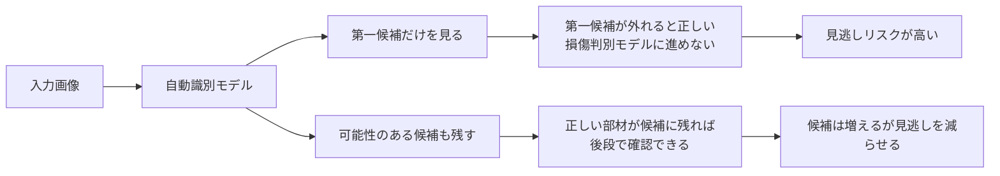
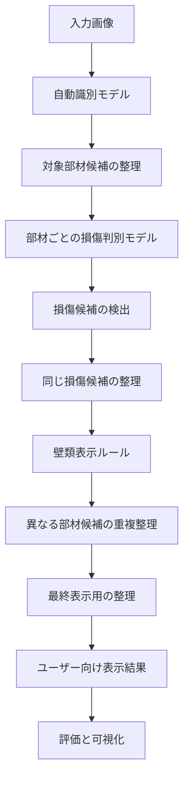
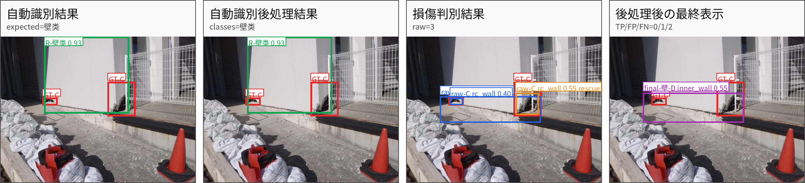
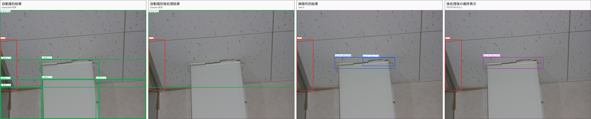
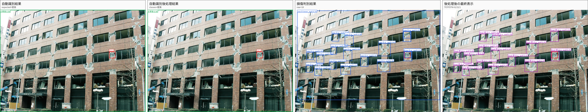
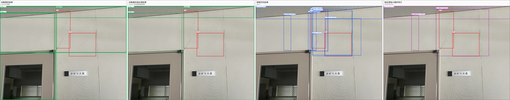
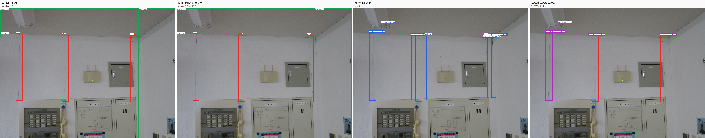
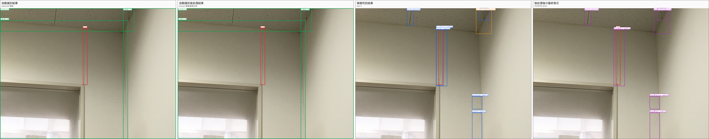
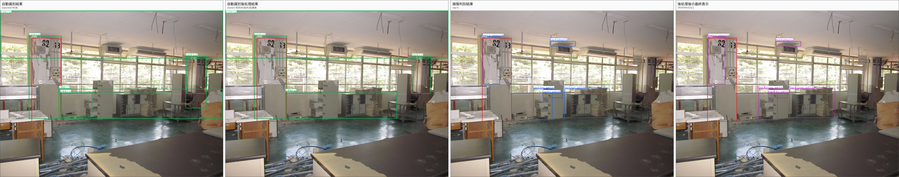
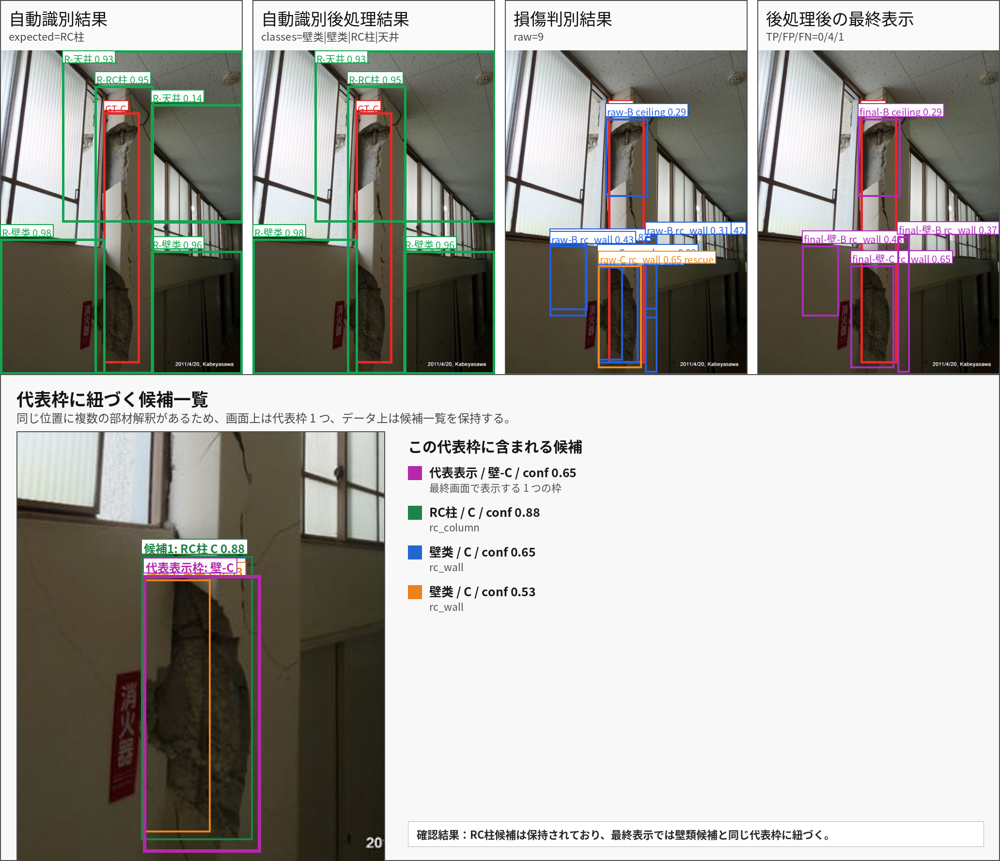

# 2026-06-24 RF-DETR 建築損傷検出 統合処理報告書

作成日：2026-06-23  
対象：建築部材の自動識別、損傷判別モデル、統合処理  
現行推奨版：`final_postprocess_v2`

---

## 1. 前回までの進捗と今回の目標

これまでの開発では、建築画像に対して以下の二段階処理を構築してきた。

1. **自動識別モデル**  
   画像内の対象部材を `天井 / 壁類 / RC柱` として検出し、どの損傷判別モデルへ送るかを決める。

2. **損傷判別モデル**  
   自動識別モデルが切り出した領域に対して、損傷等級 `B / C / D` の候補を検出する。

前回までに、YOLO9 系モデルを基準として、RF-DETR への移行を進めてきた。RF-DETR は自動識別モデルで顧客要求の Precision 0.90 を達成し、損傷判別モデルでも内壁、RC壁、RC柱を中心に改善が確認されている。

今回の目的は、単体モデルの評価だけではなく、実際の運用に近い **自動識別モデル + 損傷判別モデル + 後処理 + 最終表示** までを含めた統合処理として、現在の到達点と残課題を整理することである。
特に今回の評価では、危険建物の検出という業務上の性質を踏まえ、最終表示では **見逃しを避けることを最優先** とした。つまり、多少の余分な候補が出ることよりも、明らかな損傷候補が最終画面から消えることを避ける方針で調整している。

---

## 2. 今週の完了事項

### 2.1 天井・RC壁モデルの確認

天井および RC壁 の損傷判別モデルについて、既存評価結果を再確認した。

天井は小さいひび割れや細い線状損傷が多く、他の部材より難しい。一方で、RF-DETR では従来 YOLO9 より Precision が改善し、Recall も改善した。

RC壁については、最新の最適化モデルで Recall が改善しており、特に B 等級と D 等級では安定した検出が確認できている。C 等級はまだ難しいが、従来より改善している。

数値面では、天井 RF-DETR は調整後に Precision 0.596、Recall 0.875 となり、YOLO9 の Precision 0.593、Recall 0.845 をどちらも上回った。RC壁 RF-DETR も Precision 0.722、Recall 0.812 となり、YOLO9 の Precision 0.585、Recall 0.720 から改善している。

### 2.2 統合処理の全体調整

今回、統合処理の最終表示に関する調整を行った。

主な改善点は以下である。

| 課題 | 改善内容 |
|---|---|
| 損傷判別モデルが何も出さない場合がある | **通常より広めの確認条件で再確認し、最低限の候補を出すようにした** |
| 内壁モデルと RC壁モデルの結果が別々に表示される | **PC 表示上は `壁-B/C/D` に統合する** |
| 同じ損傷に対して複数の重複枠が出る | **近い候補をまとめ、見やすい表示にする** |
| 異なる部材候補が同じ場所で重なる | **両方の候補データをフロントエンドへ渡しつつ、画面上は代表枠を 1 つだけ表示する** |
| 明らかに一つの部材が主対象なのに別部材の細かい枠が出る | **自動識別結果が十分確実な場合に、不要な別部材候補を抑える** |

重点確認したケース では、最終表示の空出力、壁類への未統合、重複枠の多さが改善した。

数値面では、損傷候補段階の Recall が 0.740 から 0.813 に上がり、最終表示でも Recall が 0.619 から 0.633 に改善した。一方で、見逃しを避けるために候補を多く残したため、最終表示の Precision は 0.325 から 0.278 に下がっている。今回版は、危険建物検出に合わせて、Precision 最大化よりも見逃し回避を優先した調整である。

---

## 3. モデル別評価

### 3.1 自動識別モデル

自動識別モデルは、画像中のどの部材を対象にするかを決める最初のモデルである。ここで部材を間違えると、その後の損傷判別モデルも間違った前提で動くため、Precision が重要である。

過去の評価では、RF-DETR 自動識別モデルは顧客要求である Precision 0.90 を達成した。

| モデル | Precision | Recall | F1 | mAP50 | mAP50-95 |
|---|---:|---:|---:|---:|---:|
| YOLO9 | 0.863 | 0.850 | - | 0.888 | 0.775 |
| RF-DETR | **0.905** | **0.852** | **0.877** | **0.904** | **0.782** |

評価：

- RF-DETR は Precision 0.905 で目標を達成した。
- Recall も YOLO9 と同程度を維持している。
- 壁類と RC柱 の混同についても、過去の難例で改善が確認された。

一方で、実際の統合処理では「モデルが一番高く判断した部材だけ」を使うと、見逃しにつながる場合がある。建築写真では、壁と柱、天井と壁の境界が同時に写ることがあり、第一候補だけでは正しい部材が外れてしまうケースがあるためである。

そのため現在は、第一候補だけで判断せず、一定以上の確からしさがある部材候補を複数残して、損傷判別モデル側で確認する方針としている。現在版では、候補を無制限に増やすのではなく、確からしさの高い候補を最大 4 件まで残す。

この複数候補は、第一候補が外れた場合の補完として使う。危険建物検出では見逃しを避けることが重要であるため、現在は **第一候補だけに絞らず、複数候補を残す方が安全** と判断している。

### 3.2 損傷判別モデル

損傷判別モデルは、自動識別モデルが見つけた部材領域に対して、損傷等級 `B / C / D` を検出する。

過去報告と同じ見せ方に合わせ、YOLO9 基準モデルと RF-DETR の比較を整理する。

| 部材 | モデル | Precision | Recall | B Recall | C Recall | D Recall |
|---|---|---:|---:|---:|---:|---:|
| 天井 | YOLO9 基準モデル | 0.593 | 0.845 | 0.750 | 0.826 | **1.000** |
| 天井 | RF-DETR 調整版 | **0.596** | **0.875** | **0.818** | **0.917** | 0.889 |
| RC壁 | YOLO9 基準モデル | 0.585 | 0.720 | 0.739 | **0.680** | 0.667 |
| RC壁 | RF-DETR 最適化版 | **0.722** | **0.812** | **0.857** | 0.600 | **1.000** |
| 内壁 | YOLO9 基準モデル | 0.636 | 0.750 | 0.747 | 0.773 | 0.800 |
| 内壁 | RF-DETR | **0.824** | **0.848** | **0.750** | **1.000** | **0.889** |
| RC柱 | RF-DETR | **0.661** | **0.826** | **0.750** | **0.727** | **1.000** |

評価：

- 内壁は最も安定しており、Precision と Recall の両方が改善している。
- RC壁 は最適化により Recall が改善し、B と D では良好な結果となった。
- 天井は調整後に Recall 0.875 まで改善し、YOLO9 を上回った。B 等級も 0.750 から 0.818 に改善している。
- RC柱 は過去目標を上回る Recall を示しており、RF-DETR 適用の有効性が確認できている。

損傷判別モデル単体では良い候補が出ていても、統合処理では自動識別領域、部材統合、最終表示ルールが入る。そのため、単体モデルの良さがそのまま最終表示の数値に出るわけではない。

---

## 4. 統合処理の全体フローと処理ロジック

### 4.1 全体フロー

統合処理では、まず画像内の建築部材を見つけ、天井・壁類・RC柱のどれとして扱うかを決める。次に、その部材に対応する損傷判別モデルで B/C/D の損傷候補を出す。最後に、同じ損傷を示す重複枠や、内壁・RC壁のように表示上まとめるべき候補を整理し、ユーザーが確認しやすい形にして表示する。

可視化では、以下の 4 つの段階を横並びで確認できるようにしている。

| 表示 | 意味 |
|---|---|
| 自動識別結果 | RF-DETR 自動識別モデルが最初に見つけた部材候補 |
| 自動識別後処理結果 | 確信度が低い候補の整理や上位候補の選択後 |
| 損傷判別結果 | 各部材モデルが出した損傷候補 |
| 後処理後の最終表示 | ユーザーに見せる最終的な損傷表示 |

### 4.2 自動識別候補の扱い

自動識別モデルは、必ずしも 1 位候補だけが正しいとは限らない。特に `RC柱` は 1 位候補の正解率が低めであるため、複数の候補を残して損傷判別モデルに渡す。

良い点：

- 1 位候補が間違っていても、正しい部材が候補内にあれば後段で拾える。
- 危険建物検出では見逃しが最も危険であるため、複数候補を残す。

### 4.3 損傷判別モデルの候補出力

損傷判別モデルでは、通常の検出に加えて、何も検出されなかった場合に通常より広めの条件でもう一度候補を確認する。

良い点：

- 損傷候補が完全に空になることを避けられる。
- 79 番ケースのように、最初は何も出なかった画像でも候補を提示できる。

悪い点：

- 弱い候補も出るため、誤検出が増える。
- 推論時間が少し増える。

現在の判断：

- 最終表示が空になることは避けたい。
- ただし候補が増えすぎないよう、追加候補数は制限している。

### 4.4 壁類の表示ルール

壁類では、処理上は `内壁モデル` と `RC壁モデル` の両方を使う。ただし、PC 上ではユーザーに分かりやすく `壁-B / 壁-C / 壁-D` として表示する。

これは前回までの会議で確認していた方針であり、今回の統合処理でも維持している。

| 内壁モデル | RC壁モデル | PC 上の表示 |
|---|---|---|
| B | B | 壁-B |
| B | C | 壁-C |
| B | D | 壁-D |
| C | B | 壁-B |
| C | C | 壁-C |
| C | D | 壁-D |
| D | B | 壁-D |
| D | C | 壁-D |
| D | D | 壁-D |

### 4.5 重複候補の整理

損傷判別モデルは、同じ損傷に対して複数の近い枠を出すことがある。現在の統合処理では、近い候補をまとめて表示する。

良い点：

- 最終画面が見やすくなる。
- 同じ損傷に対する重複枠が減る。

悪い点：

- まとめた枠は大きくなりやすい。
- 数値評価では、教師データの小さい枠とずれて低く評価されることがある。
- 近接した複数損傷を一つにまとめてしまう可能性がある。

現在の判断：

- ユーザーが確認する画面では、細かい重複枠よりも、リスク範囲が分かることを優先する。
- 詳細確認用には、損傷判別モデルの元候補も保持している。

### 4.6 異なる部材候補が重なる場合

同じ場所に、異なる部材として解釈できる候補が同時に出る場合がある。例えば、同じ範囲に `壁類` 候補と `RC柱` 候補が重なるケースである。

現在の処理では、検出結果そのものを途中で書き換えるのではなく、最終表示段階で同一箇所の重複を整理する。異なる部材候補が重なった場合は、両方の候補データをフロントエンドへ渡し、確認用の根拠として保持する。一方で、画面上に重複枠をそのまま並べると見づらくなるため、表示枠は代表枠 1 つに整理する。

良い点：

- 78 番ケースのように、同じ場所に複数の枠が重なって表示される混乱を減らせる。
- 両方の候補データはフロントエンドへ渡すため、必要に応じて後から根拠を確認できる。

悪い点：

- 実際には RC柱 と見るべき候補を、最終表示上は壁類として見せてしまう可能性がある。
- 部材境界が曖昧な画像では、最終判断に人工確認が必要である。

### 4.7 自動識別が非常に確実な場合の整理

自動識別モデルが非常に高い信頼度で一つの部材を示している場合、他部材から出た弱い候補を最終表示から外す。

良い点：

- 74 番ケースのように、壁類画像に出た不要な天井候補を消せる。
- 最終表示が大きく改善する。

悪い点：

- 自動識別モデルが高信頼で間違えた場合、本来必要な候補を消す可能性がある。

現在の判断：

- この処理は強く確信できる場合だけ使う。
- 部材候補が拮抗している場合は無理に消さない。

---

## 5. 統合処理テストセットと数値評価

### 5.1 テストセット構成

今回の統合処理評価では、4 部材それぞれ 62 枚、合計 248 枚を使用した。

### 5.2 最終結果概要

今回の最終版では、損傷候補段階と最終表示段階を分けて評価した。損傷候補段階は、モデルが損傷らしい場所をどれだけ拾えているかを見るための結果である。最終表示段階は、ユーザーに見せる形まで整理した後の結果である。

表中の `TP / FP / FN / 予測数` は以下の意味である。

| 項目 | 意味 |
|---|---|
| TP | 正しく検出できた損傷数 |
| FP | 検出したが、教師データ上は正解扱いにならなかった候補数 |
| FN | 教師データにはあるが、検出できなかった損傷数 |
| 予測数 | システムが出した候補の総数 |

| 出力段階 | Precision | Recall | F1 | TP | FP | FN | 予測数 |
|---|---:|---:|---:|---:|---:|---:|---:|
| 損傷候補 | 0.189 | **0.813** | 0.306 | **217** | 933 | **50** | 1150 |
| 最終表示 | **0.278** | 0.633 | **0.386** | 169 | **439** | 98 | **608** |

解釈：

- 損傷候補段階では、見逃しを避けるために候補を広く拾っている。
- 最終表示では、ユーザーが確認しやすいように重複枠や近接候補を整理し、予測数を 1150 から 608 に減らしている。
- 最終表示の Recall が候補段階より低く見えるのは、後処理によって検出性能が低下したという意味ではない。
- 自動評価では、教師データの枠と同じ位置・大きさ・等級で一致した場合に正解として数える。そのため、複数の小さい枠を代表枠にまとめた場合や、壁類として統合表示した場合、画面上は妥当でも数値上は不利に計算されることがある。
- したがって、この表は「後処理で性能が下がった」ことを示すものではなく、自動評価の計算方法上、最終表示の整理結果が厳しく評価されていることを示している。最終判断は、数値と可視化結果を合わせて行う必要がある。

### 5.3 なぜ数値だけでは誤解があるか

統合処理の数値評価は重要だが、今回のような多段階処理では、数値だけで判断すると誤解が生じる。特に、後処理後の数値低下は、実際の性能低下ではなく、自動評価の計算方法による影響を含んでいる。

理由は以下である。

1. 最終表示は、細かい教師データの枠と完全一致することよりも、ユーザーが確認すべきリスク領域を示すことを重視している。
2. 壁類では、内壁モデルと RC壁モデルの結果を `壁-B/C/D` に統合している。
3. 複数の小さい枠を一つの大きい枠にまとめると、見た目には正しくても、通常の矩形一致評価では低く出ることがある。
4. 教師データにないが、画像上は損傷らしい候補を検出すると、数値上は誤検出になる。
5. 危険建物検出では、細かい枠の一致よりも、危険領域を見逃さないことが重要である。

---

## 6. 可視化結果とケース別分析

可視化は、以下の 4 段階を横並びで確認できるように作成した。

1. 自動識別結果
2. 自動識別後処理結果
3. 損傷判別結果
4. 後処理後の最終表示

全量可視化は以下に出力している。

- [全量可視化 index](../../outputs/rfdetr_prod_pipeline/eval_official_plus_20260623_all_small_boxes_full_gpu_20260623/visual_review_full_highdpi/index.html)
- [全量可視化画像フォルダ](../../outputs/rfdetr_prod_pipeline/eval_official_plus_20260623_all_small_boxes_full_gpu_20260623/visual_review_full_highdpi/images)

### 6.1 検出はできているが、代表枠が大きくなる例

このケースでは、損傷判別結果の段階では教師データに近い小さい候補が出ている。

一方で、最終表示では、近い候補や壁類候補を整理して代表枠として表示するため、精密な小枠がより大きな枠にまとめられている。そのため、画像上は損傷領域を含んでいるが、自動評価では「小さい教師データ枠と完全には一致しない」と判定されやすい。

評価上の注意点：

- モデルが損傷を見つけていないわけではない。
- 後処理により、ユーザー確認用の代表枠が大きくなっている。
- 数値評価では不利に出るが、危険領域を見逃さないという目的には合っている。

### 6.2 教師データにずれがあるが、画像上の損傷部位は検出できている例

このケースでは、教師データの位置または範囲が画像上の実際の損傷部位と完全には一致していない。

モデルは画像上で確認すべき損傷部位を検出しているが、自動評価では教師データ枠との一致を基準にするため、見た目の妥当性よりも低く評価される可能性がある。

評価上の注意点：

- 教師データが必ずしも完全な正解範囲ではない。
- モデル出力は、実画像上では妥当な損傷候補を拾っている。
- このようなケースは、数値だけでなく可視化確認が必要である。

### 6.3 教師データより多くの損傷候補を検出している例

このケースでは、教師データにある損傷だけでなく、画像上で確認すべき追加の損傷候補も検出している。

自動評価では、教師データにない候補は誤検出として数えられる。しかし、危険建物検出では、未アノテーションの損傷候補を拾うこと自体は悪い挙動ではない。むしろ、現場確認すべき候補を広めに提示できていると見ることができる。

評価上の注意点：

- 教師データにない候補は数値上 FP になる。
- ただし画像上で損傷らしい場合、実運用上は確認対象として有用である。
- 今回版は見逃し回避を優先しているため、このような候補を残す方針である。

### 6.4 壁と天井の境界線を誤って損傷として拾う例

このケースでは、壁と天井の境界線が損傷候補として検出されている。

建築画像では、部材の境界、目地、照明条件による線がひび割れに似て見える場合がある。今回のモデルは見逃しを避ける方向に調整しているため、このような線状構造を拾いやすい。

課題：

- 部材境界線と実損傷の区別はまだ難しい。
- 同様の誤検出は、今後の追加データや後処理条件で抑制する必要がある。

### 6.5 正常検出だが、天井上の設備を誤って拾う例

このケースでは、主要な損傷候補は正常に検出できている。

一方で、天井上の灯具のような設備が損傷候補として拾われている。これは、円形または高コントラストの設備が、画像上では局所的な異常領域として見えるためである。

評価：

- 主要損傷の検出としては OK。
- 設備や付帯物を損傷として拾う誤検出が残っている。
- 今後は、設備に由来する誤検出を抑えるための追加学習または表示側の注意喚起が必要である。

### 6.6 未アノテーションの損傷候補を拾う一方、天井板の境界線も拾う例

このケースでは、教師データに含まれていない損傷らしい箇所も検出できている。

一方で、二つの天井板の境界線も損傷候補として検出されている。これは前述の境界線の例と同様に、建材の境界線がひび割れに近い線状パターンとして見えるためである。

評価：

- 未アノテーションの損傷候補を拾えている点は良い。
- 天井板の境界線を損傷として拾う誤検出は課題である。
- 見逃し回避を優先すると、この種の誤検出は増えやすい。

### 6.7 明暗境界と背景物体を誤って拾う例

このケースでは、画像内の明暗の境界線や、背景に写っている引き出しのような物体が損傷候補として検出されている。

損傷モデルは、線状パターン、急な明暗差、局所的な形状変化を損傷候補として拾う傾向がある。そのため、実際の建築部材ではない背景物体や照明条件の変化も、誤検出につながる場合がある。

課題：

- 背景物体を損傷候補として拾う誤検出がある。
- 明暗差と実損傷の区別には追加データが必要である。
- 実運用では、最終確認画面で人が判断できるよう候補として残す方針が安全である。

### 6.8 斜めの天井領域と RC柱候補の扱い

このケースでは、天井領域が斜めに写っている。一方で、現在の検出枠は矩形で表現するため、斜めの領域を正確な形状のまま表すことができない。その結果、本来 RC柱 と見るべき領域が、天井または壁類の矩形候補と重なって見える。

確認結果：

- 自動識別後処理では、`RC柱` 候補が残っている。
- 損傷判別結果でも、`RC柱` モデルの C 等級候補が出ている。
- 同じ場所には、壁類側の候補も重なっている。

つまり、RC柱 の正しい候補は途中で完全に消えているわけではない。

上記の可視化では、最終表示の代表枠に対して、内部的に保持している候補一覧もあわせて示している。画面上は代表枠 1 つとして整理するが、データ上は `RC柱` 候補と壁類候補を保持しており、必要に応じて確認できる。

評価：

- 矩形枠だけでは、斜めの天井や柱の形状を完全には表現できない。
- そのため、最終画面では代表枠を 1 つに整理しつつ、候補一覧として複数の部材解釈を保持する方針が妥当である。
- このケースでは、`RC柱` 候補は保持されており、最終表示では壁類候補と同じ代表枠に紐づいている。

---

## 7. 現在の統合処理の達成事項・課題・総合判定

### 7.1 達成した目標

- RF-DETR 自動識別モデルは Precision 0.905 を達成している。
- 天井・内壁・RC壁・RC柱 の既存 4 部材について、危険建物検出に必要な見逃し回避を重視した統合処理を構築した。
- 統合処理は 248 枚をエラーなしで完走した。
- 壁類の結果を `壁-B/C/D` にまとめ、ユーザーに分かりやすい表示にした。
- 重複枠や未統合の問題を整理し、最終表示の見やすさを改善した。
- 損傷判別モデルは、教師データに含まれていないが画像上は確認すべき損傷候補も検出しており、実画像上のリスク候補を拾う能力が確認された。

### 7.2 課題

- 損傷判別モデルは見逃し回避を重視しているため、誤検出はまだ多い。
- 特に、建物本来の境界線、表面テクスチャ、目地、設備、カメラのような物体を損傷候補として拾う場合がある。
- 最終表示の整理には取捨がある。小さい枠を大きな代表枠へまとめると、画面上は見やすくなる一方、自動評価では教師データの小さい枠と一致しにくくなる。
- 逆に小さい枠をすべて残すと、正しい候補を細かく保持できるが、画面が煩雑になり、ユーザーが確認しづらくなる。

### 7.3 総合判定

既存の 4 部材については、基本的な開発目標に到達したと判断する。現在の最終版は、数値上の Precision を最大化した版ではなく、危険建物検出に合わせて、見逃し回避、リスク領域の提示、ユーザーが確認しやすい表示を優先した版である。

---

## 8. 今後の進め方

### 8.1 追加 2 カテゴリのデータ整備

既存 4 部材については、今回の統合処理で基本的な開発目標に到達した。次の作業は、追加 2 カテゴリのデータ整備を進めることである。

追加カテゴリのアノテーションには、オンラインアノテーションサービスを使用する予定である。現在、サービス環境を準備しており、今週中にアクセス用リンクとアカウント情報を共有する。

現時点では、追加カテゴリについてすぐに学習を進めるのではなく、まずアノテーション環境の準備、データ確認、アノテーション方針の整理を優先する。

---

## 9. 結論

RF-DETR への移行は、単体モデルとしては有効性が確認されている。自動識別モデルは Precision 0.905 で顧客目標を満たし、損傷判別モデルも既存 4 部材で危険建物検出に必要な見逃し回避を重視した運用に対応できる見込みである。

一方で、本番想定の統合処理では、単体モデルの結果がそのまま最終表示評価になるわけではない。自動識別、部材候補の選択、壁類統合、重複整理、最終表示の考え方が入るため、数値と可視化を合わせて判断する必要がある。

今回は、Precision 最優先の版ではなく、危険建物検出に合わせて **見逃しを避けること、リスク領域を表示すること、ユーザーが確認しやすいこと** を重視した版である。

今後は、既存 4 部材の可視化確認を継続しつつ、追加 2 カテゴリのアノテーション環境準備とデータ整備を進める。
