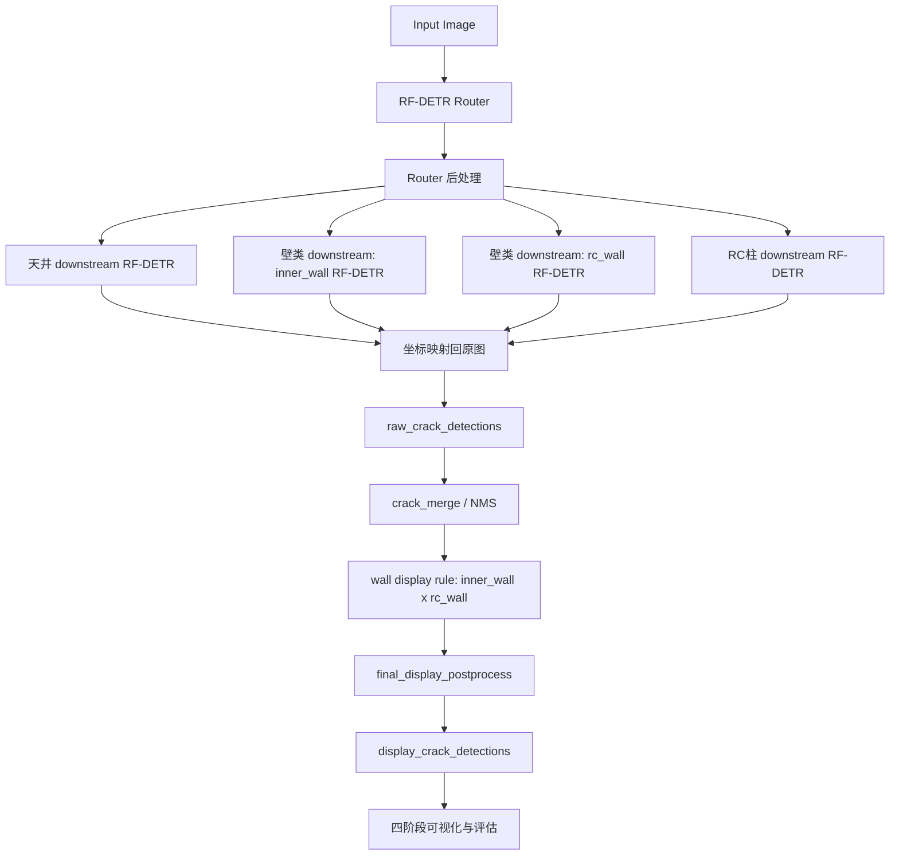

# RF-DETR 危楼损伤检测 Pipeline 汇报稿

日期：2026-06-23  
目标：面向“危楼检测”场景，优先保证召回，后处理策略遵循“漏检 >>> 检错，宁滥勿缺”。  
当前推荐版本：`final_postprocess_v2`

## 0. 执行摘要

本轮主要解决的问题不是模型权重本身，而是 pipeline 后处理：

- 早期问题 1：下游 raw 有较好检出，但最终显示被压到只剩 GT-like 的单个框，导致安全筛查视角下漏风险。
- 早期问题 2：为保留所有小框切到 `raw_all` 后，合并逻辑被绕开，最终图上大量碎框、重叠框。
- 早期问题 3：跨类候选，尤其 `RC柱` vs `壁类`，被 ambiguity 逻辑并列展开，没有归并到业务需要的 `壁` 大类。
- 早期问题 4：个别样本下游模型 raw 为空，最终也为空，需要动态低阈值兜底。

本轮 `final_postprocess_v2` 已增加三层后处理：

1. `downstream_empty_fallback`：下游 raw 为空时，低阈值二次推理，至少补出候选。
2. `wall_display + final_display_postprocess`：壁类候选先按业务规则归并到 `壁-B/C/D`，再聚类重叠框。
3. `dominant_router_filter`：router 主类非常确定时，清理明显来自低置信误路由的跨类碎框。

最终全量 248 张 GPU 评估：

| 版本 | Strict Precision | Strict Recall | Strict F1 | Loc Precision | Loc Recall | Loc F1 | Mean Latency |
|---|---:|---:|---:|---:|---:|---:|---:|
| `all_small_boxes_clustered` | 0.3058 | 0.6517 | 0.4163 | 0.3234 | 0.6891 | 0.4402 | 240.9 ms |
| `final_postprocess_v2` | 0.2780 | 0.6330 | 0.3863 | 0.3043 | 0.6929 | 0.4229 | 264.9 ms |

结论：`final_postprocess_v2` 的数值 strict 指标略低，但定位召回略高，且人工可视化上解决了重点 case 的空输出、重叠碎框、未归并到 `壁` 大类等问题。由于最终显示使用 union/cluster 框，IoU 型 strict 评估会惩罚大框，这一点需要在会上说明。

## 1. 前情提要：系统完整架构

### 1.1 总体流程

四阶段可视化固定为：

1. `Router原始`
2. `Router後処理`
3. `下流Raw`
4. `最終表示`

### 1.2 当前关键配置

配置文件：

`systems/rfdetr/pipeline/rfdetr_prod_pipeline/configs/pipeline.rfdetr_prod.all_small_boxes.yaml`

关键参数：

| 模块 | 当前策略 |
|---|---|
| Router backend | RF-DETR |
| Router conf | `router_conf_threshold=0.10`, `router_low_conf_threshold=0.03` |
| Router region policy | 最多保留 4 个 region，空时 rescue top1 |
| Downstream thresholds | tenjo `[0.30,0.40,0.40]`; inner_wall `[0.45,0.45,0.45]`; rc_wall `[0.30,0.45,0.35]`; rc_column `[0.50,0.50,0.50]` |
| Empty fallback thresholds | ceiling `[0.18,0.22,0.22]`; inner_wall `[0.22,0.22,0.22]`; rc_wall `[0.18,0.25,0.22]`; rc_column `[0.22,0.22,0.22]` |
| Wall display | `merged_plus_raw`，raw 仅补未覆盖候选 |
| Wall cluster | `IoU>=0.35` 或 `IoA_min>=0.70` 聚类 |
| Ambiguity collapse | 跨类候选中有壁类模型输出时，优先归并到 `壁` |
| Dominant router filter | 主 router 类 `confidence>=0.90` 且 margin `>=0.25` 时，仅保留主类 family |

### 1.3 最终输出字段关系

| 字段 | 含义 | 会议中如何解释 |
|---|---|---|
| `raw_crack_detections` | 下游模型直接输出，映射回原图 | 反映模型是否“看到了”损伤 |
| `crack_detections` | raw 经过 NMS/merge 后的检测 | 算法中间结果 |
| `display_crack_detections` | 最终产品/UI 展示结果 | 当前会议重点 |
| `wall_candidate_display` | 壁类 inner/rc 组合规则输出 | 解释为何显示为 `壁-B/C/D` |
| `warnings` | fallback/ambiguity/rescue 触发记录 | case-by-case 诊断入口 |

## 2. RF-DETR：Router + 下游模型指标与对比

### 2.1 Router 指标

数据来自 pipeline 全量评估 `analysis_summary.json` 的 router block。`any_candidate_hit_rate` 更符合当前召回优先策略，因为 router 会保留多个 region 给下游。

| Component | Top-1 Hit Rate | Any Candidate Hit Rate | 说明 |
|---|---:|---:|---|
| tenjo | 0.8871 | 0.9839 | router 对天井召回较好 |
| inner_wall | 0.7097 | 0.9677 | top1 有混淆，但候选内基本覆盖 |
| rc_wall | 0.7903 | 0.9194 | 有一定漏路由风险 |
| rc_column | 0.6290 | 0.9032 | top1 最弱，依赖多 region 和兜底 |

好点：

- 多候选策略下，四类 `any_candidate_hit_rate` 均超过 0.90。
- 危楼场景下，router 不宜只看 top1，保留 top4 是合理的。

坏点 / 风险：

- `RC柱` top1 只有 0.6290，容易被 `壁类` 吸走。
- `rc_wall` any candidate 低于 wall/tenjo，需要继续关注漏路由样本。

### 2.2 下游单模型已有指标

数据来自：

`final_release_20260615/models/rfdetr/metrics/selected_thresholds.csv`

| Model | Dataset | Match IoU | Threshold B/C/D | Precision | Recall | F1 | B Recall | C Recall | D Recall |
|---|---|---:|---|---:|---:|---:|---:|---:|---:|
| tenjo | `data/rfdetr_tenjo_all_non_legacy_test_v1` | 0.229 | 0.25 / 0.35 / 0.35 | 0.650 | 0.812 | 0.722 | 0.727 | 0.917 | 0.778 |
| tenjo recall priority | same | 0.229 | 0.20 / 0.35 / 0.35 | 0.614 | 0.844 | 0.711 | 0.818 | 0.917 | 0.778 |
| inner_wall | `data/rfdetr_inner_wall_all_non_legacy_test_v1` | 0.229 | 0.25 / 0.40 / 0.40 | 0.811 | 0.909 | 0.857 | 0.875 | 1.000 | 0.889 |
| inner_wall precision priority | same | 0.229 | 0.40 / 0.40 / 0.40 | 0.824 | 0.848 | 0.836 | 0.750 | 1.000 | 0.889 |
| rc_wall optimized | `data/rfdetr_rc_wall_all_non_legacy_test_v1` | 0.229 | 0.28 / 0.45 / 0.25 | 0.722 | 0.812 | 0.765 | 0.857 | 0.600 | 1.000 |

注意：

- 这些是单模型测试集指标，match IoU 为 0.229，不等同于 pipeline 最终 display 的 IoU=0.50 评估。
- 当前 pipeline 中 `rc_column` 没有找到同格式单模型指标；本报告只报告 pipeline 内 `rc_column` 分项。

### 2.3 Pipeline 内下游表现观察

`final_postprocess_v2` 中，低阈值兜底触发次数：

| Fallback | Count |
|---|---:|
| `downstream_empty_fallback:ceiling:1` | 53 |
| `downstream_empty_fallback:inner_wall:1` | 133 |
| `downstream_empty_fallback:rc_wall:1` | 66 |
| `downstream_empty_fallback:rc_column:1` | 35 |
| `full_image_rescue_detections:1` | 33 |
| `full_image_rescue_detections:2` | 6 |

解读：

- 低阈值兜底触发频繁，说明原始阈值下确实存在“下游 raw 空”的风险。
- 召回优先策略会增加 FP 和 latency，但符合危楼检测的安全目标。

## 3. Pipeline 整体数值结果

### 3.1 多版本对比

| Run | Matched | Strict P | Strict R | Strict F1 | Loc P | Loc R | Loc F1 | Mean ms | P90 ms |
|---|---:|---:|---:|---:|---:|---:|---:|---:|---:|
| conservative_baseline | 248 | 0.3242 | 0.6217 | 0.4262 | 0.3457 | 0.6629 | 0.4544 | 170.5 | 449.8 |
| conservative_optimized | 248 | 0.5047 | 0.6067 | 0.5510 | 0.5296 | 0.6367 | 0.5782 | 136.5 | 390.8 |
| router_005_top4_recall_guard | 248 | 0.3976 | 0.6105 | 0.4815 | 0.4220 | 0.6479 | 0.5111 | 199.3 | 513.2 |
| all_small_boxes | 248 | 0.2570 | 0.6517 | 0.3686 | 0.2718 | 0.6891 | 0.3898 | 226.0 | 668.7 |
| all_small_boxes_clustered | 248 | 0.3058 | 0.6517 | 0.4163 | 0.3234 | 0.6891 | 0.4402 | 240.9 | 713.4 |
| final_postprocess_v2 | 248 | 0.2780 | 0.6330 | 0.3863 | 0.3043 | 0.6929 | 0.4229 | 264.9 | 738.5 |

### 3.2 当前推荐版本分项

`final_postprocess_v2`：

| Component | Strict P | Strict R | Strict F1 | Loc P | Loc R | Loc F1 |
|---|---:|---:|---:|---:|---:|---:|
| overall | 0.2780 | 0.6330 | 0.3863 | 0.3043 | 0.6929 | 0.4229 |
| tenjo | 0.3028 | 0.6825 | 0.4195 | 0.3310 | 0.7460 | 0.4585 |
| inner_wall | 0.2532 | 0.5417 | 0.3451 | 0.2857 | 0.6111 | 0.3894 |
| rc_wall | 0.3000 | 0.5735 | 0.3939 | 0.3385 | 0.6471 | 0.4444 |
| rc_column | 0.2637 | 0.7500 | 0.3902 | 0.2747 | 0.7812 | 0.4065 |

好点：

- `rc_column` 定位召回提高到 0.7812，解决了部分“下游无输出”的问题。
- overall localization recall 达到 0.6929，是当前几版中最高。
- 可视化层面，重点样本的空输出、碎框、未归并到 `壁` 的问题明显改善。

坏点 / 代价：

- strict recall 从 clustered 的 0.6517 降到 0.6330。
- precision 降低，整体 FP 增加。
- mean latency 从 240.9 ms 增到 264.9 ms，主要来自 empty fallback 二次推理。
- union/cluster 显示框会变大，IoU=0.50 评估对这类显示框不友好。

建议会上明确区分：

- `raw_crack_detections` / `crack_detections`：模型检测能力。
- `display_crack_detections`：产品展示与安全筛查结果。
- 当前数值评估直接用 display 框，会低估“发现风险区域”的能力。

### 3.3 当前后处理逻辑与参数取舍

这一节用于向用户解释：当前最终版本不是“模型直接输出”，而是围绕危楼检测目标做了多层 recall-first 后处理。每层参数都有明确取舍：提高召回通常会带来更多误检、更多重叠框、更高延迟；提高 precision 通常会压掉弱检出，从而增加漏检风险。

#### 3.3.1 Router selection：决定哪些区域送入下游

当前逻辑：

1. RF-DETR router 先输出 `天井 / 壁类 / RC柱` region。
2. `router_min_region_confidence=0.08` 以下 region 不送入下游。
3. `router_max_regions=4`，最多保留 4 个 router region。
4. 如果筛完为空，`router_rescue_top_k_if_empty=1`，至少保留 top1。
5. 对天井有 `dominant_router_class_policy`：当天井置信度极高、面积足够大、且与其他类别有 margin 时，只保留天井 region。

| 参数 | 当前值 | 调高的效果 | 调低的效果 | 当前取舍 |
|---|---:|---|---|---|
| `router_conf_threshold` | 0.10 | router 更干净，少误路由；但弱构件可能不进下游 | router 候选更多，召回更高；但下游计算和 FP 增加 | 设低，保障召回 |
| `router_low_conf_threshold` | 0.03 | 低置信 rescue 更保守 | 空图时更容易补候选 | 仅兜底使用 |
| `router_min_region_confidence` | 0.08 | 少跑低质量 region，precision 提升 | 更多弱 region 进入下游，召回提升 | 偏低，保留弱可疑区域 |
| `router_max_regions` | 4 | 更少 region，速度快、误检少 | 更多 region，召回高但更乱 | top4 是当前平衡点 |
| `router_rescue_top_k_if_empty` | 1 | 空 router 时仍可能无输出 | 保证至少有 region 进入下游 | 保底 top1 |

好处：

- 避免 router top1 错误导致全链路漏检。
- `RC柱` top1 较弱，但 any-candidate 命中率超过 0.90，多 region 策略能补上。

风险：

- 多 region 会触发跨类下游模型，增加 `壁类 / RC柱 / 天井` 混杂输出。
- 低置信 router 进入下游后，最终需要更强的 display 聚类和过滤，否则可视化会碎。

#### 3.3.2 Region transport 与坐标映射

当前默认：

- `region_transport=ndarray_slice`
- `region_padding_ratio=0.12`

逻辑：

1. 根据 router bbox 裁剪局部区域。
2. 向外 padding 12%，避免裂缝在 router 边缘被截断。
3. 下游模型在 crop 上推理。
4. 下游 bbox 映射回原图坐标。

| 参数 | 当前值 | 增大效果 | 减小效果 | 当前取舍 |
|---|---:|---|---|---|
| `region_padding_ratio` | 0.12 | 更不容易截断损伤；但引入邻近构件和背景 | 更精准、更少误检；但边缘裂缝容易丢 | 偏召回，略放大 |

好处：

- 对跨 router 边界的裂缝更稳。
- 能解释部分 final union 框比 GT 大的现象。

风险：

- padding 后下游可能看到非目标构件，导致跨类误检。
- 如果 router box 本身很大，padding 会让下游输入接近全图，输出更杂。

#### 3.3.3 Downstream thresholds：下游模型初始阈值

当前主阈值：

| Model | B | C | D | 说明 |
|---|---:|---:|---:|---|
| ceiling | 0.30 | 0.40 | 0.40 | 天井 B 类适度放低 |
| inner_wall | 0.45 | 0.45 | 0.45 | 原本较保守 |
| rc_wall | 0.30 | 0.45 | 0.35 | B/D 相对放低 |
| rc_column | 0.50 | 0.50 | 0.50 | 最保守，因此需要 empty fallback |

调参影响：

| 调整 | 好处 | 坏处 |
|---|---|---|
| 降低 B/C/D 阈值 | raw 检出增加，漏检减少，尤其弱裂缝和远处小裂缝 | FP 增加；同一裂缝多个框增加；后处理压力增加 |
| 提高 B/C/D 阈值 | precision 提高，可视化更干净 | 危楼场景下风险更大，容易 raw 为空 |
| 单独降低 B 阈值 | 对轻微裂缝召回更好 | B 类背景纹理/接缝 FP 增加 |
| 单独降低 D 阈值 | 严重损伤更不容易漏 | 高等级误报会影响业务优先级 |

当前取舍：

- 主阈值不无限降低，避免 raw 阶段过度爆炸。
- 对 raw 为空的 region，再用 `downstream_empty_fallback` 低阈值兜底。
- 这样比“一开始全局低阈值”更可控。

#### 3.3.4 Downstream empty fallback：下游无输出时的动态兜底

当前配置：

| Model | fallback B/C/D |
|---|---|
| ceiling | 0.18 / 0.22 / 0.22 |
| inner_wall | 0.22 / 0.22 / 0.22 |
| rc_wall | 0.18 / 0.25 / 0.22 |
| rc_column | 0.22 / 0.22 / 0.22 |

逻辑：

1. 如果某个 detector 在某个 router region 上 raw 输出为空。
2. 使用该 detector 的 backend 以低阈值重新推理一次。
3. 每个 region 最多补 `max_outputs_per_region=1` 个。
4. 输出 warning，例如 `downstream_empty_fallback:rc_column:1`。

| 参数 | 当前值 | 调高效果 | 调低效果 | 当前取舍 |
|---|---:|---|---|---|
| fallback thresholds | 0.18-0.25 | 兜底更保守，FP 少 | 更容易补出候选，漏检少 | 偏低，保证不空 |
| `max_outputs_per_region` | 1 | 保守，避免兜底刷屏 | 如果增大，可补多个裂缝 | 当前只补一个最高置信候选 |

好处：

- 解决 79 这类“下游 raw 无输出，最终为空”的问题。
- 不影响已经有 raw 输出的正常 region，只在空输出时触发。

坏处：

- 增加推理次数和延迟。
- 如果 router region 本身错了，兜底也会在错误区域补候选。
- 低阈值候选质量不如主阈值候选，需要最终过滤兜住。

当前最终版本的权衡：

- 对危楼检测，“空输出”比“补一个低置信候选”风险更高。
- 因此允许兜底增加 FP，但限制每个 region 最多 1 个，控制可视化复杂度。

#### 3.3.5 Crack merge：模型输出去重

当前配置：

- `crack_merge.mode=nms`
- `same_grade_iou_threshold=0.90`
- `cross_grade_iou_threshold=0.95`
- `prefer_higher_grade=true`

逻辑：

1. raw 映射回原图后，先按 NMS 合并。
2. 同等级框 IoU 超过 0.90 才压掉。
3. 不同等级框 IoU 超过 0.95 才压掉。
4. 高等级优先。

参数影响：

| 参数 | 当前值 | 调低效果 | 调高效果 | 当前取舍 |
|---|---:|---|---|---|
| `same_grade_iou_threshold` | 0.90 | 更强去重，框更少 | 保留更多相近框 | 高阈值，避免误删小框 |
| `cross_grade_iou_threshold` | 0.95 | 不同等级互相压制更多 | 不同等级候选都保留 | 极高阈值，避免压掉严重等级 |
| `prefer_higher_grade` | true | 高等级优先保留 | 若关掉，按置信度优先 | 危险等级优先 |

好处：

- 最大限度避免 raw 阶段误删小裂缝。
- 对安全筛查友好。

坏处：

- raw/merged 数量偏多。
- 如果没有后续 display 聚类，可视化会很碎。

当前最终版本的权衡：

- `crack_merge` 保守，尽量不删。
- 真正面向 UI 的压框放到 `final_display_postprocess`，这样 raw 信息仍可审计。

#### 3.3.6 Wall display：壁类业务归并

当前配置核心：

- `wall_display.mode=merged_plus_raw`
- `raw_source_models=["inner_wall","rc_wall"]`
- `raw_append_if_uncovered=true`
- `raw_covered_ioa_threshold=0.80`
- `raw_covered_iou_threshold=0.50`
- `pair_iou_threshold=0.60`
- `pair_ioa_threshold=0.98`
- `use_union_bbox_for_pairs=false`

逻辑：

1. `inner_wall` 与 `rc_wall` 在同一壁类 router region 中并行输出。
2. 如果两者空间重叠达到 pair 阈值，则按业务矩阵合成 `壁-B/C/D`。
3. 已参与 group 的 raw 不再重复追加。
4. 没被 group 覆盖的 raw 作为 recall 兜底追加。

参数影响：

| 参数 | 当前值 | 调低效果 | 调高效果 | 当前取舍 |
|---|---:|---|---|---|
| `pair_iou_threshold` | 0.60 | 更多 inner/rc 被配对，最终更干净 | 配对更严格，保留更多单模型框 | 中高，避免误配 |
| `pair_ioa_threshold` | 0.98 | 包含关系更容易配对 | 只有几乎完全包含才配对 | 很高，避免大框吞小框 |
| `raw_append_if_uncovered` | true | 若关掉，会更干净但可能漏独立小框 | 开启后保留未覆盖 raw | 开启，宁滥勿缺 |
| `raw_covered_ioa_threshold` | 0.80 | 更容易认为 raw 已被覆盖，最终更少框 | 更容易追加 raw，召回更强 | 中高，避免重复画 |
| `use_union_bbox_for_pairs` | false | 若 true，pair 框更大、覆盖更全 | false 保留代表框几何 | 当前 false，避免过度扩大 pair |

好处：

- 解决“实际输出优于 GT，但最终只剩 GT 一个框”的问题。
- 保留独立小检出框，不让 pair 逻辑吞掉所有 raw。

坏处：

- 未覆盖 raw 会增加 final 候选数量。
- pair 阈值过严时，用户会感觉“没有合并”；过松时，会误合并不相关损伤。

当前最终版本的权衡：

- 先保证未覆盖 raw 不丢。
- 再通过 display cluster 解决视觉重叠，而不是在 wall pairing 阶段直接删 raw。

#### 3.3.7 Wall display cluster：壁类重叠框最终聚类

当前配置：

- `merge_overlapping_display_items=true`
- `display_cluster_iou_threshold=0.35`
- `display_cluster_ioa_threshold=0.70`

逻辑：

1. 对最终 wall display items 做同 family 聚类。
2. 如果两个 wall 框 IoU >= 0.35，或小框大部分被包含 `IoA_min>=0.70`，合成一个 union display 框。
3. 成员候选保留在 `candidates` / `display_merge_members` 中。

参数影响：

| 参数 | 当前值 | 调低效果 | 调高效果 | 当前取舍 |
|---|---:|---|---|---|
| `display_cluster_iou_threshold` | 0.35 | 更容易合并，final 更干净 | 更少合并，保留更多局部框 | 偏低，解决碎框 |
| `display_cluster_ioa_threshold` | 0.70 | 包含关系更容易合并 | 小框更容易保留 | 中等，保留独立区域 |

好处：

- 解决 70、74、77 这类“重叠太多、太杂碎”的问题。
- final panel 更适合会议展示和人工巡检。

坏处：

- union 框变大，IoU=0.50 strict 指标会下降。
- 多个相邻损伤可能被合成一个大框，不利于数值逐框匹配。

当前最终版本的权衡：

- 产品最终展示优先表达“这里有风险区域”。
- raw/merged 仍保留细粒度候选，供 debug 和后续人工复核。

#### 3.3.8 Ambiguity collapse：跨类候选归并

当前配置：

- `collapse_ambiguity.enabled=true`
- `prefer_wall_when_present=true`

逻辑：

1. 如果 `RC柱` 与 `壁类` 在同位置重叠，早期版本会全部以 `ambiguous_class_candidate` 展开。
2. 当前版本如果 ambiguity group 中存在 wall 模型候选，则最终显示优先归并到 `壁` 大类。
3. 代表输出状态为 `wall_ambiguity_resolved`。

参数影响：

| 参数 | 当前值 | 开启效果 | 关闭效果 | 当前取舍 |
|---|---|---|---|---|
| `collapse_ambiguity.enabled` | true | final 更干净，业务类别更明确 | 保留所有跨类候选，人工信息更多但画面乱 | 开启 |
| `prefer_wall_when_present` | true | 有 wall 候选时归到 `壁` | 可能保留 RC柱/天井并列候选 | 开启，符合用户对 78 的反馈 |

好处：

- 解决 78：“下游 raw 没问题，但最终没有归并到 `壁` 大类”。
- 减少同一位置多类别重复框。

坏处：

- 如果真实构件是 RC柱，但 wall 模型也误检，可能被归到 `壁`。
- 这是一条业务倾向规则，不是纯模型置信度规则。

当前最终版本的权衡：

- 用户明确希望这类 case 归到 `壁` 大类。
- 危楼筛查中，“提示为壁类风险”比“展开多个业务类别导致审查困难”更可接受。

#### 3.3.9 Same-family final cluster：所有类别最终去重

当前配置：

- `final_display_postprocess.cluster_same_family.enabled=true`
- `iou_threshold=0.35`
- `ioa_threshold=0.70`

逻辑：

1. 对最终 display items 按 family 分组：`wall / 天井 / RC柱`。
2. 同 family 的重叠框再次聚类。
3. 非 wall 的天井、RC柱也会被合并，例如 70 的两个天井重叠框。

参数影响：

| 参数 | 当前值 | 调低效果 | 调高效果 | 当前取舍 |
|---|---:|---|---|---|
| `iou_threshold` | 0.35 | 合并更激进，final 更少框 | 合并更保守，保留细节 | 偏低，压碎框 |
| `ioa_threshold` | 0.70 | 小框更容易被包含合并 | 小框更容易留下 | 中等 |

好处：

- 解决非 wall 类别的重叠问题。
- 使 final display 更接近产品 UI 的可读结果。

坏处：

- 多裂缝相邻时可能合成一个大框。
- 对逐框 GT 评估不友好。

当前最终版本的权衡：

- 会议展示和业务巡检以“风险区域覆盖”为主。
- 不用 final display 直接代表模型细粒度检测能力。

#### 3.3.10 Dominant router filter：强主类过滤

当前配置：

- `dominant_router_filter.enabled=true`
- `classes=["天井","壁类","RC柱"]`
- `min_confidence=0.90`
- `min_confidence_margin=0.25`

逻辑：

1. 如果 router top1 类别非常确定，且比其他类别至少高 0.25。
2. 最终 display 只保留与 top1 类别同 family 的结果。
3. 例如 74：router 强判 `壁类`，则低置信天井碎框被清理。

参数影响：

| 参数 | 当前值 | 调高效果 | 调低效果 | 当前取舍 |
|---|---:|---|---|---|
| `min_confidence` | 0.90 | 更少触发，更安全但碎框多 | 更常触发，final 更干净但可能误删 | 高阈值，谨慎触发 |
| `min_confidence_margin` | 0.25 | 需要更强类别优势才过滤 | 更容易按 top1 清理 | 中高，避免错删 |

好处：

- 有效清理强主类图中的跨类误检。
- 解决 74 中低置信天井碎框问题。

坏处：

- 如果 router 高置信错判，会压掉真实其他类别。
- 不适合多构件真实共存的图像。

当前最终版本的权衡：

- 只有 top1 很强且 margin 充足才生效。
- 弱主类、多类别接近时，不强制过滤，保留候选。

#### 3.3.11 Final output fallback：最终为空兜底

当前配置：

- `final_output_fallback.enabled=true`
- `restore_suppressed=true`
- `rebuild_wall_display_if_empty=true`
- `include_merged_candidates=true`
- `include_raw_candidates=true`
- `max_outputs=12`

逻辑：

1. 如果所有后处理后 final display 为空。
2. 从 suppressed、relaxed wall display、merged、raw 中按优先级恢复候选。
3. 最多输出 12 个。

参数影响：

| 参数 | 当前值 | 好处 | 风险 |
|---|---|---|---|
| `restore_suppressed` | true | 避免 display merge 误删后空输出 | 可能恢复低质量框 |
| `rebuild_wall_display_if_empty` | true | 壁类特殊兜底 | 可能放宽后合并更多 |
| `include_raw_candidates` | true | 最强召回保障 | FP 增加 |
| `max_outputs` | 12 | 防止最终刷屏 | 太低可能仍漏多个区域 |

当前取舍：

- 最终不允许轻易空输出。
- 这层只在 final display 为空时触发，因此平时不影响常规图。

#### 3.3.12 为什么最终选择 `final_postprocess_v2`

与 `all_small_boxes_clustered` 相比：

| 维度 | `all_small_boxes_clustered` | `final_postprocess_v2` | 取舍 |
|---|---|---|---|
| Strict Recall | 0.6517 | 0.6330 | v2 略低 |
| Loc Recall | 0.6891 | 0.6929 | v2 略高 |
| RC柱 Loc Recall | 0.6719 | 0.7812 | v2 明显更好 |
| 可视化碎框 | 较多 | 明显减少 | v2 更适合汇报和 UI |
| 空输出兜底 | 较弱 | 更强 | v2 更安全 |
| 延迟 | 240.9 ms | 264.9 ms | v2 稍慢 |
| 误检 | 较少 | 更多 | v2 接受 FP 换召回 |

最终权衡：

- 本任务是危楼检测，漏检成本高。
- 现阶段宁愿保留可疑区域，也不希望 final display 为空或把 raw 中已经检出的损伤删掉。
- `final_postprocess_v2` 不是数值 strict 最优，而是“安全筛查 + 人工可读 + 可审计”的折中版本。
- 后续若用户更重视 precision，可从以下方向收紧：
  - 提高 `downstream_empty_fallback` 阈值。
  - 降低 `max_outputs_per_region` 或关闭部分模型 fallback。
  - 提高 `display_cluster_iou_threshold`，保留更局部的框。
  - 提高 `dominant_router_filter.min_confidence`，减少强主类过滤误删。
  - 对低面积、边缘、低置信候选增加只进 debug、不进 final display 的规则。

## 4. 可视化结果与重点表格

### 4.1 产物路径

全量结果：

- JSONL：`outputs/rfdetr_prod_pipeline/eval_official_plus_20260623_final_postprocess_v2_gpu/results.jsonl`
- 评估：`outputs/rfdetr_prod_pipeline/eval_official_plus_20260623_final_postprocess_v2_gpu_eval`
- 高 DPI review：`outputs/rfdetr_prod_pipeline/visual_review_20260623_final_postprocess_v2_highdpi`
- 高 DPI index：`outputs/rfdetr_prod_pipeline/visual_review_20260623_final_postprocess_v2_highdpi/index.html`

重点 8 case：

- JSONL：`outputs/rfdetr_prod_pipeline/debug_postprocess_focus_20260623_v2/results.jsonl`
- Focus split eval：`outputs/rfdetr_prod_pipeline/debug_postprocess_focus_20260623_v2_eval_focus_split`
- 8 case 高 DPI review：`outputs/rfdetr_prod_pipeline/visual_review_20260623_postprocess_focus_v2_8cases_highdpi`
- 8 case index：`outputs/rfdetr_prod_pipeline/visual_review_20260623_postprocess_focus_v2_8cases_highdpi/index.html`

### 4.2 重点 8 case 分析

| Case | Image | 原问题 | final v2 结果 | 好点 | 仍需关注 |
|---|---|---|---|---|---|
| 01 | `rc_wall__data_add100__c-40537.jpg` | 左侧 GT 未检出 | raw 3 / final 1，`wall_display_cluster_merged` | 左侧 GT 被 final 大壁类框覆盖；低阈值和 full image rescue 生效 | final union 框较宽，strict IoU 仍不一定算 TP |
| 63 | `rc_wall__data_add100__3-C-40152.jpg` | 下游模型疑似未检出明显 RC | raw 4 / final 2 | 低阈值补出候选 | 仍存在一个小 `壁-C`，需继续判断是否可接受 |
| 66 | `rc_wall__data_add100__c-40597.jpg` | 多个框重叠 | raw 2 / final 1 | inner/rc wall 合并成一个 `壁-B` | 数值上仍可能因框大被 IoU 惩罚 |
| 70 | `tenjo__data_add100__a-10062.jpg` | 结果范围没问题，但多个框重叠 | raw 2 / final 1 | 两个天井重叠框合成一个 `display_family_cluster_merged` | GT 有 2 个时，单 union 框可能漏 strict match |
| 74 | `inner_wall__data_add100__b-30125.jpg` | 归并逻辑有问题，重叠太多太杂碎 | raw 9 / final 1 | 强主类过滤去掉低置信天井碎框，只保留壁类大框 | 依赖 router 主类高置信；弱主类场景不会这么激进 |
| 77 | `inner_wall__labels_20251107__b-40390.jpg` | 归并逻辑有问题 | raw 10 / final 2 | wall cluster 收敛，左/右两块区域分开 | 一个区域显示 `壁-D`，需业务确认高等级优先是否合理 |
| 78 | `rc_column__data_add100__4-B-00138.jpg` | raw 没问题，但最终没有归并且没有归到 `壁` 大类 | raw 9 / final 5 | 中央主裂缝已用 `wall_ambiguity_resolved` 归到 `壁-B` | 右侧/底部仍保留独立小壁类候选；若要更干净需加小面积/边缘框规则 |
| 79 | `rc_column__data_add100__4-C-00026.jpg` | 下游 raw 无输出，需要兜底 | raw 4 / final 2 | 低阈值兜底补出 RC柱候选；最终不再空 | 低阈值也带来 wall 候选，靠 dominant router filter 清理 |

8 case 图像路径：

| Index | Visualization |
|---:|---|
| 00 | `outputs/rfdetr_prod_pipeline/visual_review_20260623_postprocess_focus_v2_8cases_highdpi/images/00_rc_wall__rc_wall__data_add100__c-40537.jpg` |
| 01 | `outputs/rfdetr_prod_pipeline/visual_review_20260623_postprocess_focus_v2_8cases_highdpi/images/01_rc_wall__rc_wall__data_add100__3-C-40152.jpg` |
| 02 | `outputs/rfdetr_prod_pipeline/visual_review_20260623_postprocess_focus_v2_8cases_highdpi/images/02_rc_wall__rc_wall__data_add100__c-40597.jpg` |
| 03 | `outputs/rfdetr_prod_pipeline/visual_review_20260623_postprocess_focus_v2_8cases_highdpi/images/03_inner_wall__inner_wall__labels_20251107__b-40390.jpg` |
| 04 | `outputs/rfdetr_prod_pipeline/visual_review_20260623_postprocess_focus_v2_8cases_highdpi/images/04_rc_column__rc_column__data_add100__4-C-00026.jpg` |
| 05 | `outputs/rfdetr_prod_pipeline/visual_review_20260623_postprocess_focus_v2_8cases_highdpi/images/05_tenjo__tenjo__data_add100__a-10062.jpg` |
| 06 | `outputs/rfdetr_prod_pipeline/visual_review_20260623_postprocess_focus_v2_8cases_highdpi/images/06_rc_column__rc_column__data_add100__4-B-00138.jpg` |
| 07 | `outputs/rfdetr_prod_pipeline/visual_review_20260623_postprocess_focus_v2_8cases_highdpi/images/07_inner_wall__inner_wall__data_add100__b-30125.jpg` |

### 4.3 用户标注 60-79：分类总结

用户上一轮标注主要可以分为四类：

| 类别 | 原标注 index | 问题 | 本轮处理 |
|---|---|---|---|
| 整体 OK | 60, 61, 62, 64, 65, 67, 68, 69, 72, 73, 75, 76 | 无需重点改动 | 保持召回优先策略 |
| 下游模型问题 | 63, 71, 79 | raw 弱或为空 | 加 `downstream_empty_fallback` |
| 重叠/碎框问题 | 66, 70, 74, 77 | 多框重叠、杂碎 | 加 same-family cluster、wall cluster、dominant router filter |
| 归并到业务类别问题 | 78 | raw 有，但最终未归并到 `壁` 大类 | 加 `collapse_ambiguity`，优先归并 wall candidates |
| 轻微 FP 可接受 | 27 | 一处误检，总体 OK | 保持，不为 precision 牺牲 recall |
| 未覆盖 GT | 01 | 左侧 GT 没覆盖 | low-threshold + full-image rescue 后 final 大框覆盖 |

### 4.4 好的点

- `79` 从 final 空输出变为有 RC柱兜底输出。
- `74` 从多个低置信天井/壁类碎框变为一个壁类大框。
- `70` 从两个重叠天井框变为一个合并框。
- `78` 中央主裂缝从 RC柱/壁类 ambiguity 展开，收敛为 `壁-B`。
- `66` 这种 inner/rc wall 重叠框可以稳定聚合为 `壁-B`。
- 全量定位召回略升，尤其 RC柱定位召回提升明显。

### 4.5 坏的点 / 剩余风险

- final display 使用 union/cluster 框，数值 IoU=0.50 会低估实际“风险发现”能力。
- `downstream_empty_fallback` 触发频繁，说明原阈值偏保守；但低阈值会引入更多 FP。
- `78` 一类样本右侧/底部独立小框仍保留，这是 recall-first 的结果；如要更清爽，需要新增“小面积/边缘/低置信”规则。
- `RC柱` 单模型独立测试指标当前缺失，明天会上不能把 pipeline 分项误讲成单模型指标。
- `dominant_router_filter` 依赖 router 高置信。如果 router 高置信错判，可能压掉其他类别候选。当前设置了 margin 保护，但仍需持续 review。

## 5. 建议明天汇报的叙述顺序

1. 先讲业务目标：危楼筛查，漏检代价大于误检。
2. 说明系统不是单模型输出，而是 router + 下游 + 多层后处理。
3. 展示单模型 RF-DETR 指标，强调模型本体基本可用。
4. 展示 pipeline 多版本对比，说明为何从 conservative 走向 recall-first。
5. 展示重点 8 case 四阶段图：
   - 01：左侧 GT 被补上。
   - 79：从无输出到有兜底输出。
   - 74：碎框压成壁类大框。
   - 78：归并到 `壁` 大类。
6. 最后说明剩余问题：
   - 数值 IoU 与产品显示目标有冲突。
   - 需要后续增加“display 指标”和“raw 模型指标”分离评估。

## 6. 后续建议

短期：

- 固化 `final_postprocess_v2` 为会议 demo 版本。
- 继续人工 review 新 top80 的 60-79，因为排序已随新结果变化，不能直接沿用旧 index。
- 对 78 类右侧/底部小框，增加可选规则：低面积、边缘、低置信候选只进入 debug，不进入 final display。

中期：

- 增加两套评估：
  - raw/downstream 召回指标：评估模型是否看到损伤。
  - display/UI 指标：评估最终展示是否覆盖风险区域。
- 补齐 `rc_column` 单模型测试指标，和 tenjo / inner_wall / rc_wall 放在同一表中。
- 针对 `rc_wall` 和 `RC柱` 的 router 混淆样本建立 hard case set。

## 7. 关键文件

- Pipeline runner：`systems/rfdetr/pipeline/rfdetr_prod_pipeline/pipeline/run_full_pipeline.py`
- 当前配置：`systems/rfdetr/pipeline/rfdetr_prod_pipeline/configs/pipeline.rfdetr_prod.all_small_boxes.yaml`
- 全量结果：`outputs/rfdetr_prod_pipeline/eval_official_plus_20260623_final_postprocess_v2_gpu/results.jsonl`
- 全量评估：`outputs/rfdetr_prod_pipeline/eval_official_plus_20260623_final_postprocess_v2_gpu_eval/analysis_summary.json`
- 全量高 DPI review：`outputs/rfdetr_prod_pipeline/visual_review_20260623_final_postprocess_v2_highdpi/index.html`
- 重点 8 case review：`outputs/rfdetr_prod_pipeline/visual_review_20260623_postprocess_focus_v2_8cases_highdpi/index.html`
