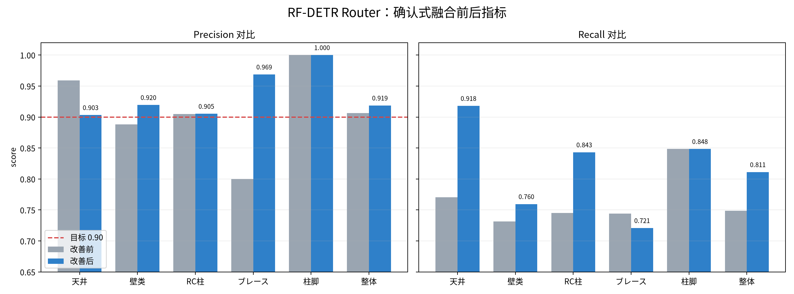
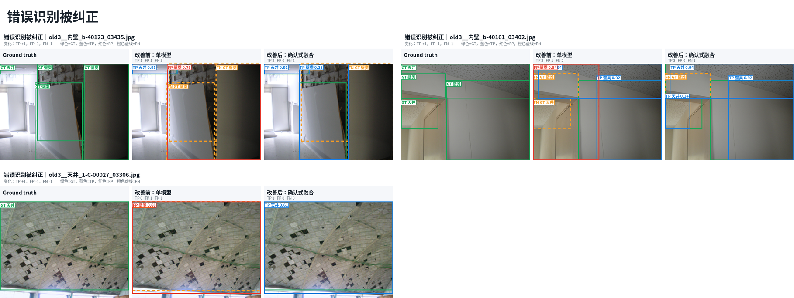
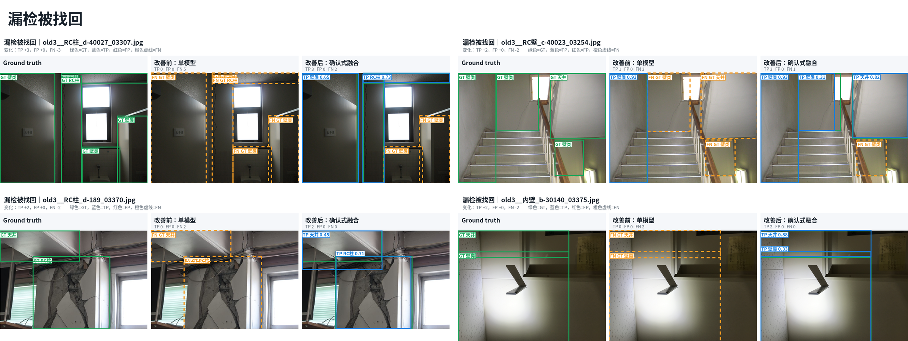
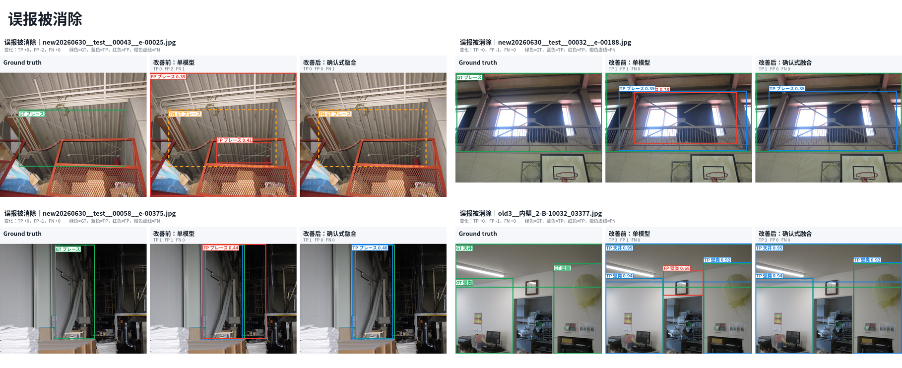

# 2026-09-01 RF-DETR Router 改善前后可视化检查

本页展示同一张图片在以下三个视图中的差异：

1. Ground truth；
2. 改善前的生产五分类单模型；
3. 改善后的确认式融合。

图中颜色含义：

- 绿色实线：GT；
- 蓝色实线：与同类别 GT 在 IoU 0.50 下匹配的 TP；
- 红色实线：没有匹配 GT 的 FP；
- 橙色虚线：没有被预测匹配的 FN。

所有案例均由脚本根据逐图 TP/FP/FN 变化自动排序选择。可视化使用 OpenCV 生产口径预测缓存，417 张汇总结果严格复现改善前 `563 TP / 58 FP / 189 FN` 和改善后 `610 TP / 54 FP / 142 FN`。

---

## 1. 整体指标变化



主要变化：

- 壁类 Precision：`0.8882 → 0.9195`；
- ブレース Precision：`0.8000 → 0.9688`；
- 天井 Recall：`0.7705 → 0.9180`；
- RC柱 Recall：`0.7451 → 0.8431`；
- 整体 Recall：`0.7487 → 0.8112`；
- 五个类别的 Precision 最终全部严格大于 0.90。

---

## 2. 原先识别不对、改善后被纠正



这组案例同时满足：改善前存在 FP，改善后 FP 被移除，并且至少一个原 FN 被正确类别候选找回。

其中最直观的是第三张天井案例：

- 改善前把图像判断成 `壁类 0.66`，与天井 GT 类别不符，因此产生 `1 FP + 1 FN`；
- 改善后保留较低置信度但获得历史三分类模型支持的 `天井 0.61`；
- 最终变为 `1 TP + 0 FP + 0 FN`。

前两张室内场景也显示了类似作用：原模型在天井、墙面同时出现时产生错误壁类候选或漏掉正确区域；确认式融合一方面拒绝不受历史模型支持的错误候选，另一方面允许受到支持的较低分正确候选通过。

---

## 3. 原先漏检、改善后被找回



代表变化：

- `old3__RC柱_d-40027_03307.jpg`：`0 TP / 5 FN → 3 TP / 2 FN`；
- `old3__RC壁_c-40023_03254.jpg`：`1 TP / 3 FN → 3 TP / 1 FN`；
- `old3__RC柱_d-189_03370.jpg`：`0 TP / 2 FN → 2 TP / 0 FN`；
- `old3__内壁_b-30140_03375.jpg`：`0 TP / 2 FN → 2 TP / 0 FN`。

这些改善主要来自“降低主模型候选阈值，但要求历史三分类模型提供同类别空间确认”。单纯降低阈值会增加 FP；增加确认条件后，较低分但结构位置一致的天井、壁类和 RC柱候选可以被恢复。

---

## 4. 原先误报、改善后被消除



代表变化：

- 第一张ブレース案例中，原模型产生两个不匹配 GT 的候选；历史五分类模型不支持它们，融合后两个 FP 均被拒绝；
- 第二、三张ブレース案例保留正确 TP，同时各移除一个重叠或位置不正确的 FP；
- 第四张室内场景保留三个正确天井/壁类结果，同时移除一个错误壁类候选。

第一张同时说明该方法的边界：虽然两个 FP 被消除，但该图的 GT ブレース仍未找回。因此确认式融合显著改善 Precision，但并不保证每个被拒绝 FP 的图像同时改善 Recall。

---

## 5. 单图文件与机器可读清单

每个案例的三联对比原图位于：

```text
docs/reports/assets/router_precision_ensemble_20260901/
  recognition_corrections/
  missed_recovered/
  false_positives_removed/
```

自动选例及逐图变化清单：

```text
docs/reports/assets/router_precision_ensemble_20260901/selected_cases.csv
docs/reports/assets/router_precision_ensemble_20260901/selected_cases.json
```

汇总复核：

```text
docs/reports/assets/router_precision_ensemble_20260901/summary.json
```

生成脚本：

```text
systems/rfdetr/scripts/generate_router_precision_ensemble_visuals.py
```

---

## 6. 解读限制

这些图是冻结交付集上的代表案例，用于解释最终指标为何变化。该冻结集也参与了 operating-point 搜索，因此这些图片不能作为未见数据泛化证明。正式验收仍需要一份没有参与模型或阈值选择、且采用统一人工标注规范的新数据集。
